# 第二章 密码学基础

## 第一节 密码学概述

### 密码的起源

1. 原始符号
2. 古代隐写术
3. 古代语言隐写术
4. 斯巴达密码棒
5. 达·芬奇密码筒

### 古典密码

1. **古典替换**：将明文字母替换成其他的字母、数字和符号
   - **凯撒密码**：单表替换密码，每个字母用其后第3个字母替换（广义为移动K个位置），如“Caesar cipher is a shift substitution”加密后为“FDHVDU FLSKHU LV D VKLIW VXEVWLWXWLRQ”。

   - **维吉尼亚密码**：多表替换密码，引入密钥概念，根据密钥决定用哪一行密表代换，掩盖字母频率特征，如明文“polyalphabetic cipher”，密钥“RADIO”，加密后为“GOOGOCPKTP NTLKQZPKMF”。
   - 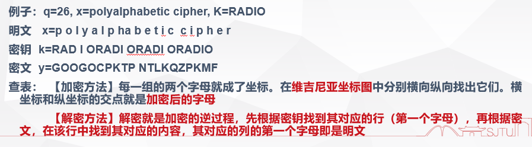
   - 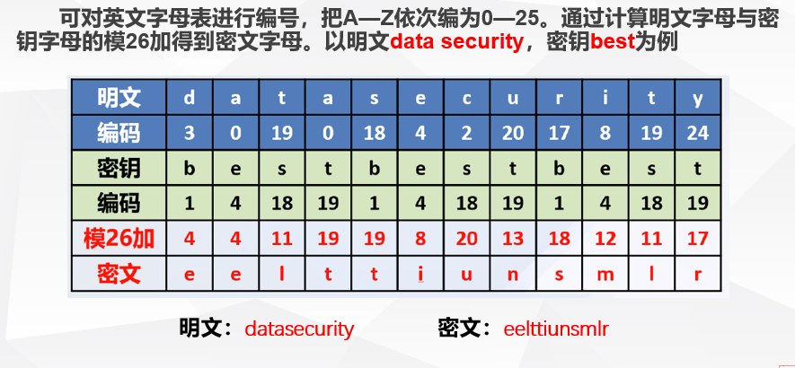

   - **普莱费尔密码**：多字母代换密码，基于5×5字母矩阵，将明文中双字母组合转换为密文双字母组合
      - 加密规则:按成对字母加密
      - 相同对中的字母加分隔符(任意字符，如X)，对明文进行分组，每2个字母一组，如果明文的字母数为奇数，在最后加上一个无效字母补位(如x)。
      - balloon → ba lx lo on
      - 同行取右边: he → EC
      - 同列取下边: dm → MT
      - 其他取交叉: kt → MQ；OD → TR

   - **Hill密码（仿射密码）**：m个连续明文字母用m个密文字母代替，由m个线性方程决定，如m = 2时，对明文“july”加密，密钥K为特定矩阵，加密结果为“DELW”。
  
2. **古典置换（换位密码）**：通过重新排列明文字符位置实现加密
   - **栅格换位**
   - 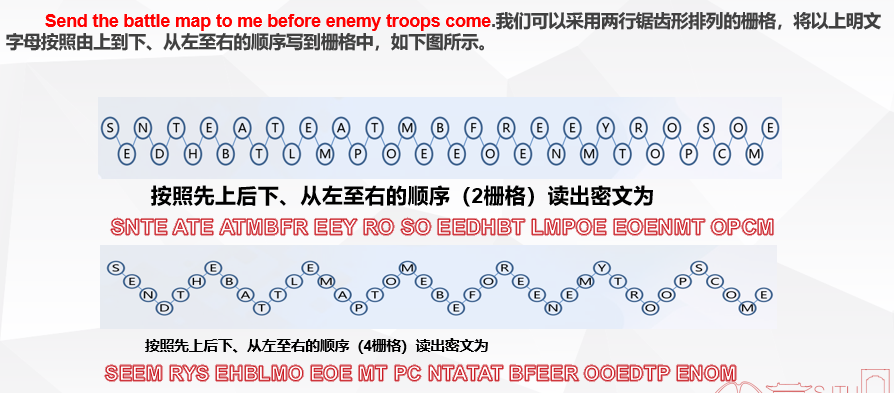
   - **矩形换位**
   - 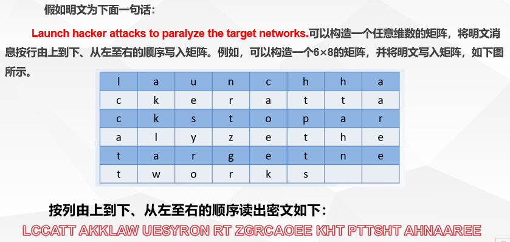

3. **一次一密密码**：密钥本身随机，而且密钥只使用一次。
   - 即使获得了上次通信的密文和密钥，攻击者仍然无法确定下次通信的真正密钥；
   - 需要建立庞大的随机字母集，工作量巨大，而且存在密钥分发的问题。
   - **费纳姆密码**：将明文与密钥进行模2加法（比特XOR，即异或）运算，若密钥只使用一次，为一次一密密码。

### 机械密码

1. **转轮密码机ENIGMA**：德国发明家亚瑟·谢尔乌比斯发明，二战期间德军使用，安全性高，有多个转轮，组合可能性众多，后被数学家艾伦·图灵破解，其设计体现了加密系统保密性基于密钥保密的理念。

2. **紫色密码机**：日本外务省在二战期间使用的机械式密码机，工作原理与Enigma机类似，被美国威廉·弗里德曼破译小组破解，对美军在中途岛海战及击毙山本五十六等事件中发挥重要作用。

3. **其他机械密码机**：包括从未被破解的Sigaba（与Enigma工作原理相似）、C - 36（瑞典海军使用）、M - 209（美军二战及朝鲜战争中使用）。

### 现代密码

1. **现代密码理论基础**：1949年Claude Shannon发表保密系统的通信理论，奠定现代密码理论基础，用信息论观点分析密码系统相关概念。
2. **保密通信系统的数学模型**：信源、加密器、信道、解密器、信宿。
   - 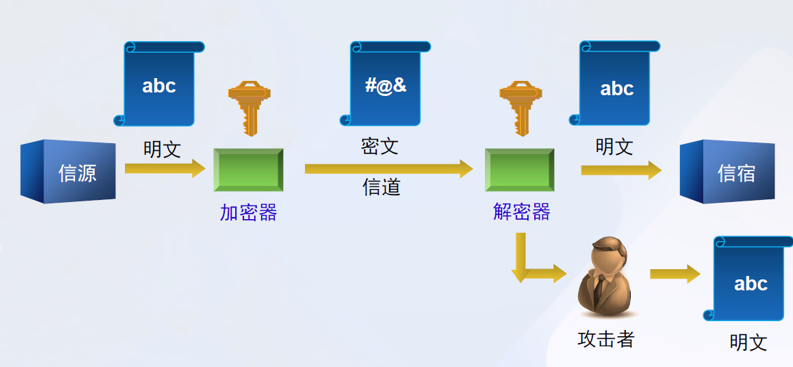
1. **信息隐藏和信息保密**：
   - 信息隐藏（隐匿信息存在）：将秘密信息嵌入表面上看起来无害的宿主信息中，使攻击者无法直观地判断他所监视的信息中是否含有秘密信息，目的是使攻击者不知道哪里有秘密,它隐藏了信息的存在形式。
   - 信息保密（隐匿信息真意）：信息加密是利用单钥或双钥密码算法把明文变换成密文并通过公开信道送到接收者手中，保护的是信息的内容。
2. **DES数据加密标准**：组合、混乱、扩散、分组密码设计
   - 组合（Combine）：由简单易于实现的密码系统进行组合，构造较复杂的、密钥量较大的密码系统，如加权和及乘积法。
   - 混乱(Confusion)：为了避免密码分析者利用明文与密文之间的依赖关系进行破译，密码的设计应该保证这种依赖关系足够复杂，使明文和密文、密钥之间的统计相关性极小化。 通常的方法是“替换(Substitution)”
   - 扩散(Diffusion)：为避免密码分析者对密钥逐段破译，密码的设计应该保证密钥的每位数字能够影响密文中的多位数字；同时，为了避免密码分析者利用明文的统计特性，密码的设计应该保证明文的每位数字能够影响密文中的多位数字，即将每一位明文及密钥尽可能迅速地散布到较多位密文数字中去，从而隐藏明文的统计特性。通常的方法是“换位(Permutation)”
   - 分组密码设计：输入分段处理、非线性变换、左右交换和密钥控制下的多次迭代，如Feistel结构。
3. **公钥密码体制**：又称双钥密码体制或非对称密码体制（Two-key/AsymmetricCryptosystem），就是在加密和解密的过程中分别使用不同的密钥
4. **密码技术分支**：包括数字签名、认证码、Hash函数、密码协议等，现代密码学研究建立安全密码体制和破译敌方密码体制。
5. **密码体制五大特性**：保密性、完整性、可用性、认证性、不可否认性
6. **量子密码**：利用量子态作为信息载体，基于量子力学原理（如薛定谔方程、测不准原理、不可克隆定理）实现量子密钥分发，具有不可窃听性和一次一密不可破译性，但未超出Shannon的信息理论和密码理论范畴。

### 密码学面临的挑战

1. **云计算/存储**：用户担心云上数据丢失、失效、泄密、篡改及隐私泄露，云计算对密码有新需求，如感知数据存在、确保数据安全和隐私，研究热点包括数据持有证明、完全同态加密。
2. **大数据**：数据量巨大且增长迅速，具有4V特点（Volume、Velocity、Variety、Value），密码算法需处理大规模数据，提高效率和适应性，在存储、传输处理等方面带来新挑战和需求。
3. **物联网**：万物互联面临数据、网络、系统安全及隐私保护问题。
   - 物联网的安全要求：
      - 密码要适应数据多样性（物体多样性使数据多样性）
      - 密码要适应网络多样性、多层次(传感网、无线网、有线网、内网和外网)
      - 密码要适应各层次的资源差异较大(感知层资源弱，管理层资源强)，因此需要多密码、多密钥、多安全级别、跨域互联互通。
4. **新型计算机**：量子计算机（如D - Wave公司产品）可在多项式时间内解决大整数分解难题，冲击RSA等加密算法，加快密钥搜索速度，量子计算机和DNA计算机发展对现有密码算法构成威胁。
5. **区块链技术**：一方面区块链需要在众多节点间通过共识机制达成一致导致其性能低下；另一方面区块链核心技术的突破还需要依赖密码技术底层算法、协议的突破；密码技术是区块链基础核心，但专业人才匮乏。

## 第二节 密码学基本概念

### 密码体制

1. **密码体制基本概念**
   - **密码学的定义**：
      - 保密学（密码学 Cryptology）：研究信息系统安全保密的科学，包括秘密通信和破译密码的方法。
      - 密码编码学（Cryptography）：研究对信息进行编码，实现信息隐蔽的学科。
      - 密码分析学（Cryptanalytics）：研究加密消息的破译或消息的伪造，恢复被隐藏信息的本来面目。
   - **密码系统组成**：
      - 明文字母空间、密文字母空间、密钥空间和算法。
      - 两个基本单元是算法和密钥。

2. **密码体制基本概念**
   - **明文与密文**：
      - 明文：需要秘密传送的可读消息，构成明文消息空间M。
      - 密文：明文经过密码变换后的不可读消息，构成密文消息空间C。
   - **加密与解密**：
      - 加密：由明文到密文的数学变换。
      - 解密：从密文恢复出明文的数学变换。
   - **加密算法与解密算法**：
      - 加密算法：对明文进行加密时采用的规则。
      - 解密算法：对密文进行解密时采用的规则。
   - **密钥**：
      - 密钥：加密和解密时使用的秘密信息，包括加密密钥空间K和解密密钥空间K'。
   - **加密/解密过程**：
      - 加密算法E：M × K → C；解密算法D：C × K' → M。
      - 加密/解密关系：对于所有m ∈ M, c ∈ C, c = Eke(m), m = Dkd(c) = Dkd(Eke(m))。

3. **对称加密与非对称加密**
   - **单钥加密体制（对称加密体制）**：
      - 加密密钥ke等于解密密钥kd。
      - 对称加密算法使用起来简单快捷，密钥较短，且破译困难。如：DES、IDEA、TDEA（即3DES）、AES
   - **双钥加密体制（非对称加密体制）**：
      - 加密密钥ke不等于解密密钥kd。
      - 特点：实现多个用户加密的消息只能由一个用户解读（加密）；一个用户加密消息而使多个用户可以解读（数字签名）。
      - 非对称加密算法需要两个密钥：公开密钥（publickey）和私有密钥（privatekey）。公开密钥与私有密钥是一对，如果用公开密钥对数据进行加密，只有用对应的私有密钥才能解密；如果用私有密钥对数据进行加密，那么只有用对应的公开密钥才能解密。
      - 加密算法可以把加密密钥和算法公开，所以任何人都可用之来加密要传送的明文信息。但只有拥有解密密钥的人才能将传送过来的已经加了密的消息解密，还原原信息。

### 密码分析

1. **密码分析与密码安全性**
   - **密码分析**：
      - 密钥分析的实质是在攻击者不知道密钥的情况下，对所截获的密文或明-密文对采用各种不同的密码分析方法试图恢复出明文或密钥。
   - **密码设计的安全性**：
      - 无条件安全：无论破译者有多少密文，他也无法解出对应的明文，即使他解出了，他也无法验证结果的正确性；具有无限计算资源（诸如时间、空间、资金和设备等）的密码分析者也无法破译某个密码系统
      - 计算上安全：理论上可破译，但实际运用时破译的代价超出信息本身的价值，破译的时间超出了信息的有用寿命
   - **密码分析类型**：
      - 唯密文攻击、已知明文攻击、选择明文攻击、选择密文攻击、选择文本攻击
      - 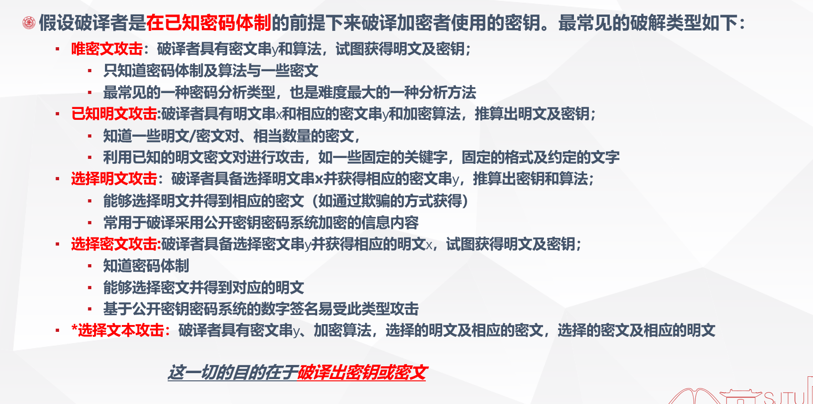
   - **密码分析方法**：
      - 穷举攻击法
        - 穷尽密钥搜索攻击（完全试凑法）
      - 数学攻击法
        - 差分密码分析：通过分析明文对的差值对密文对的差值的影响来恢复某些密钥比特.（针对分组密码）
        - 确定性分析法--线性密码分析：本质上是一种已知明文攻击方法,通过寻找一个给定密码算法的有效的线性近似表达式来破译密码系统
        - 确定性分析法--插值攻击方法：使用一个代数函数来代表一个S-Box，此函数可以用已知明文攻击法取得样本点，再用拉格朗日插值法产生。这个代数函数可能是在有限体上的二次函数、多项式函数或有理函数。
        - 统计分析法：利用明文的已知统计规律进行破译的方法。
      - 物理攻击法
        - 侧信道攻击：针对密码实现（包括密码芯片、密码模块、密码系统等）的物理攻击方法。
        - 本质上是利用密码实现在执行密码相关操作的过程中产生的侧信息来恢复出密码实现中所使用的密钥。
        - 侧信息（Side Channel Information）：除了攻击者通过除主通信信道以外的途径获取到的关于密码实现运行状态相关的信息，典型的侧信息包括密码实现运行过程中的能量消耗、电磁辐射、运行时间等信息。
        - 侧信道攻击主要面向密码实现的物理安全性，采用能量分析攻击、电磁分析攻击、计时攻击、缓存攻击、故障攻击等一系列方法对其实现安全性进行分析
        
### 密码学理论基础
   - 密码学基本数学知识
      - **模运算**：求余运算，包括取模运算、模加法、模减法、模乘法、模指数、求逆运算（若存在𝑎𝑏=1𝑚od 𝑛 ，则a、b互为逆元）。
      - **整数分解**：又称为素因数分解，是将一个大于1的自然数写成素数乘积的形式。
      - **欧几里得算法**：求两个整数最大公因子的快速算法。设a和b是两个任意正整数，gcd(a, b)为它们的最大公因子，gcd(a, b)= gcd(b, a mod b)
      - **有限域**：元素个数有限的域，又被称为Galois域。域内定义了加法和乘法，集合内的元素经过加法和乘法计算，结果仍然在集合内。计算符合交换率、结合率、分配率，加法和乘法有单位元素（所有的集合内的值都有对应的负数，所有集合内非零值都有倒数）
      - **中国剩余定理**：求解一次同余式组的方法。
      - **椭圆曲线**：定义在实数域上的椭圆曲线，可以构成一个Abel群。

### 国内外密码算法概览
1. **序列密码原理（流密码）**
   - 定义： 明文m与伪随机序列k结合，通过加密变换生成密文c，解密过程与加密过程相同且互逆。
   - 数学表达：由种子密钥通过密钥流发生器得到的密钥流K，加密变换为C，其中ci = mi ⊕ ki。
   - 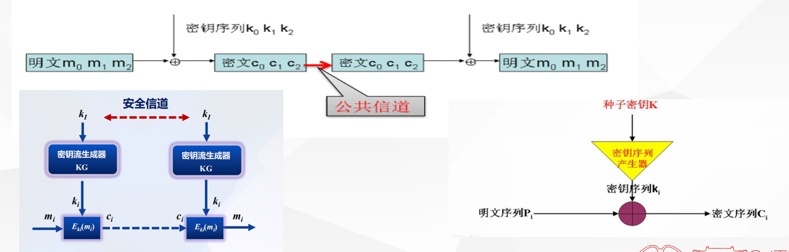
   - 特点：实现简单、便于硬件实施、加解密处理速度快、没有或只有有限的错误传播
   - 由有限状态机产生的序列是伪随机序列
   - 典型算法：RC4
2. **分组密码**
   - 定义：将明文消息编码表示后的数字序列划分成长度为n的组，在密钥k的控制下变换成等长的输出数字序列。
   - 典型分组密码：DES、IDEA、RC5、RC6、CAST-128等。
   - 设计要求：分组长度足够大，密钥量足够大，算法足够复杂，加密、解密算法简单，数据无扩展，差错传播尽可能小。
3. **Feistel密码结构**
   - 定义：Feistel密码结构是一种迭代密码结构，由Horst Feistel提出，用于设计分组密码。
   - 安全性：单个循环（轮）的Feistel结构不能提供足够的安全性，但多个循环（轮）可以显著提高安全性。
   - 特点：
     - **分组大小**：明文消息编码表示后的数字序列划分成长度为n的组。
     - **密钥大小**：密钥有不同的产生算法，密钥的长度影响密文的安全性。
     - **迭代轮数**：多轮重复循环处理，典型的循环次数是16次。
     - **子密钥产生算法**：用于产生加密过程中的密钥。
     - **轮函数**：函数越复杂，安全性越好，更能抵抗密码分析，包括加法、减法和异或，固定循环/移位等。
4. **DES算法**
   - 定义：DES（Data Encryption Standard）是一种分组密码，假设明文m是有0和1组成的长度为64比特的符号串，密钥k也是64比特的0,1符号串。
   - 有效密钥：64比特密钥k只有56比特有效，其余8位是奇偶校验位，在算法中不起作用。
   - DES算法细节：
     - **初始置换IP和初始逆置换IP$^{-1}$**：DES过程中的初始和最终步骤，用于重新排列明文和密文的比特。
     - **S盒替代**：DES中的关键步骤，使用固定的替换表（S盒）对数据进行非线性变换。
5. **三重DES算法(TDEA)** 
   - 定义：三重DES（Triple DES）算法使用3倍DES密钥长度的密钥，执行3次DES算法，以提高安全性。
   - TDEA算法模式：
     - **DES-EEE3模式**：使用三个不同的密钥（k1, k2, k3），进行三次加密。
     - **DES-EDE3模式**：使用三个不同的密钥（k1, k2, k3），采用加密-解密-加密模式。
     - **DES-EEE2模式**：使用两个不同的密钥（k1= k3, k2），进行三次加密。
     - **DES-EDE2模式**：使用两个不同的密钥（k1= k3, k2），采用加密-解密-加密模式。
6. **高级加密标准AES**
   - 定义: AES（Advanced Encryption Standard）是NIST于2001年公布的加密标准，取代DES算法。
   - AES算法特点：
     - **结构**：AES不具有Feistel结构，而是采用基于块的密码结构。
     - **操作**：每轮进行“字节替换”、“行移位”、“列混淆”、“轮密钥加”，共10轮迭代。
   - AES算法举例：
     - 分组 16字节  128位
     - 子秘钥 44个，每个 32位，每轮使用4个字，128位
     - 每轮进行“字节替换”、“行移位”、“列混淆”、“轮密钥加”
     - 10轮迭代，但是非Feistel结构
     - 每一步都简单可逆A⊕B⊕B = A
     
7. **公钥加密体制**
   - 定义：公钥技术是加密史上的一个革命性进步，改变了密钥分发的方式，具备密钥分配和管理、数字签名和身份认证、数据加解密等功能。
   - 特点：
     - 基于数学函数而不是对“位”的形式的简单操作（如替换和置换、逻辑加、乘和异或）
     - 加/解密钥是**非对称**的：公钥密码体制使用两个不同的密钥，在机密性、密钥分配及认证领域中，具有深远的影响。
     - **密钥管理**：私钥为密码拥有者保管，不涉及分发问题，公钥通过公开渠道分发而不影响安全性。
     - 通常要求足够大的密钥长度 (>1024 bits) ，密钥太长会导致加密速度缓慢，因此公钥算法常用于密钥传递，而一般 不用于实时的数据加密
   - 单向陷门函数
     - 公钥密码体制是基于单向陷门函数的概念。
     - **单向函数**是一些易于计算但难于求逆的函数
     - **单向陷门函数**就是在已知一些额外信息的情况下易于求逆的单向函数，这些额外信息就是所谓的陷门。
     - 构造公钥密码系统的关键是如何在求解某个单向函数的逆函数的NP完全问题中设置合理的“陷门”。
   - 典型公钥算法：
     - RSA算法三种方式都适合
     - Diffe-Hellman算法只适合于密钥交换
     - DSS（数字签名标准）适合于数字签名
     - EIGamal适合于前两种
     - 椭圆曲线算法（ECC）三种都适合。
   - 加密方案：
      - **公钥加密方案**
         1. **基于公开密钥的加密过程**：
            - **加密过程**：当Alice给Bob发信息时，她使用Bob的公钥KB对消息加密，Bob使用自己的私钥KSB对密文解密。
         2. **公钥算法应用——认证**：
            - **认证过程**： 当Alice给Bob发信息时，她使用自己的私钥KSA对消息加密（签名），Bob使用Alice的公钥KAP对密文解密，认证。
      - **公钥+常规密钥结合的加密方案**
         1. **结合加密方案原理**：
            - **方案概述**：利用公开加密的方法来保护常规加密密钥的传送，保证常规加密密钥的安全性，然后用常规加密方法来保护传送的数据。
         2. **结合加密方案特点**：
            - **效率与安全性**： 这种方法利用了公开加密方法的安全性特点和常规加密方法的速度快和适应性强的特点，同时避免了公开加密方法加/解密速度慢的缺点。
8. **RSA算法**
   - 定义：RSA算法是一种公钥密码算法，涉及两个素数p和q，计算n=pq，φ(n)=(p–1)(q–1)，随机选取整数e，计算d，满足de≡1 (modφ(n))。
   - **RSA算法加密解密**：
     - **加密算法**：c=E(m)≡me(mod n)
     - **解密算法**：D(c)≡cd(mod n)
9. **Rabin公钥密码算法**
   - 定义：Rabin公钥密码算法的安全性基于**模合数平方根困难的困难性**。
   - 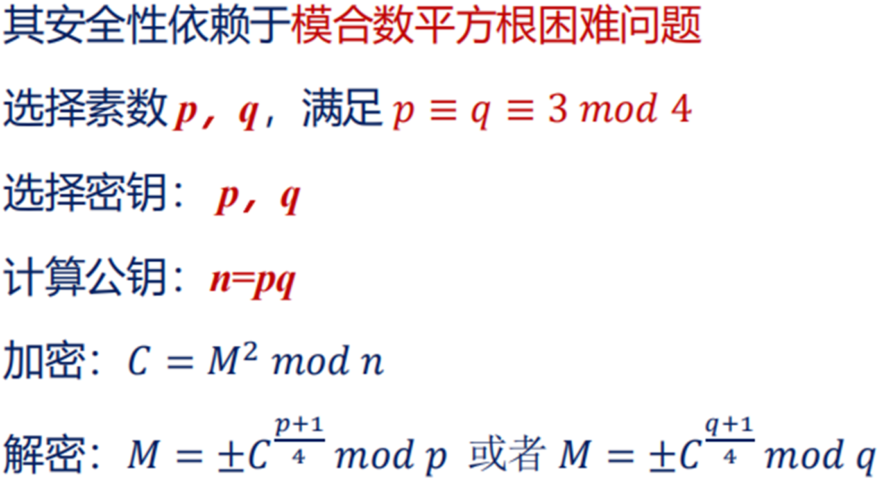
10. **Diffie-Hellman算法——密钥交换**
   - 定义：Diffie-Hellman算法允许两个用户可以安全地交换一个秘密信息，用于后续的通讯过程。
   - 算法的安全性依赖于**计算离散对数的难度**。
   - Diffie-Hellman算法过程：
      - 密钥交换过程：双方获得a及p：p是一个素数，a是P的原根，通过计算得到共享密钥K。
11. **ElGamal公钥密码算法**
   - 定义：ElGamal公钥密码体制安全性是基于**有限域上计算离散对数的困难性**。
12. **椭圆曲线公钥密码算法（ECC）**
   - 定义：ECC实际上是将原有的经典的加密算法通过某些运算移植到安全的椭圆曲线方程上。
   - 特点：
     - **安全性与效率**：椭圆曲线离散对数问题（ECDLP）是椭圆曲线密码学的基础，具有安全性高、密钥尺度小、实现速度快的优点。
13. **单向散列算法**
   - 定义：单向散列函数是根据输入消息输出固定长度数值的算法，输出数值也称为“散列值”或“消息摘要”。
   - 特点：
     -   散列函数  h=H（M），其中，M是发长的报文，h是定长的散列值。设x、x′是两个不同的消息，如果H（x）=H（x′），则称x和x′是哈希函数H的一个（对）碰撞（collision）
     
     - **安全性设计**：强加密单向散列函数是这样设计的：不可能通过计算找出两条散列值相同的消息。
   - **MD5和SHA-1**：
     - **MD5**：生成128位的散列值。
     - **SHA-1**：生成160位的散列值。
   - **SHA-2系列算法**：
     - **SHA-2系列**：包括SHA-224、SHA-256、SHA-384和SHA-512。
14. **国产密码**
   - 定义：国密算法是国家商用密码管理办公室指定的一系列密码标准，包括SM1、SM4、SM2、SM3、ZUC等。
   - 特点：
     - **自主性与安全性**：从根本上摆脱对国外密码技术和产品的过度依赖，实现加密、解密和认证等功能。

## 第三节 密码学新进展及研究方向

### 公钥密码
1. **公钥基础设施 (PKI)**
   - 定义：用公钥概念与技术来实施和提供安全服务的具有普适性的安全基础设施
   - PKI是生成、管理、存储、分发和吊销基于公钥密码学的公钥证书所需要的硬件、软件、人员、策略和规程的总和。**其最基本的元素是数字证书。**
   - 证书权威（CA）对用户证书带来了复杂的管理问题
   - 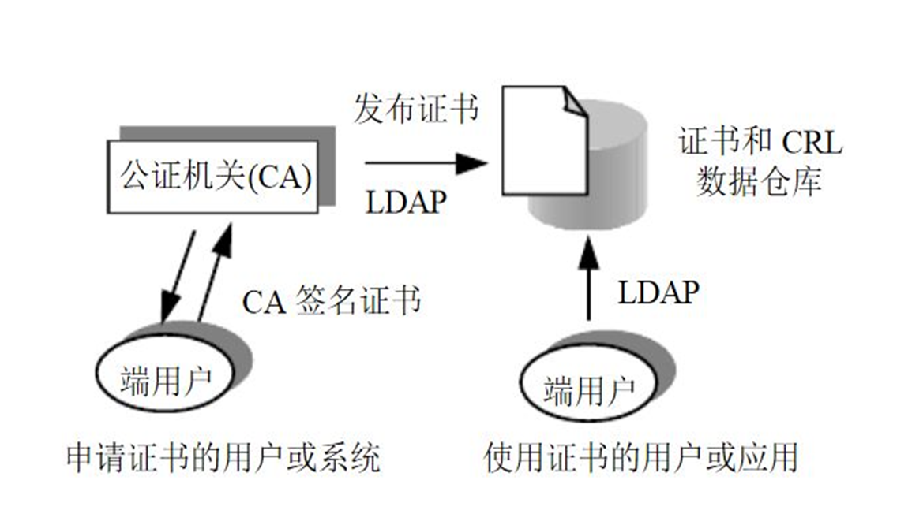

2. **公钥证书(数字证书)**
   - 公钥证书由证书管理机构CA为用户建立，其中的数据项包括与该用户的秘密钥相匹配的公开钥及用户的身份和时间戳等，**所有的数据项经CA用自己的秘密钥签字后就形成证书**。
   - 
   - 公钥证书是用来绑定实体姓名以及该实体的其它相关属性和相应公钥的凭证。s是网络环境中的一种身份证，用于证明某一用户的身份及其公开密钥的合法性。
   - 使用X.509协议，广泛应用在网络安全设施：IP安全协议、SSL、SET和S/MIME。

3. **身份基公钥密码 (IBC)**
   - 使用能唯一标识用户身份的信息作为公钥，例如电话号码或Email地址等，简化了传统公钥密码体系中的用户证书管理。
   - 在身份基公钥密码中，用户公钥可以为任意的比特串。用户私钥通过可信第三方，即PKG生成。
   - 身份基公钥密码密钥生成过程：
   - 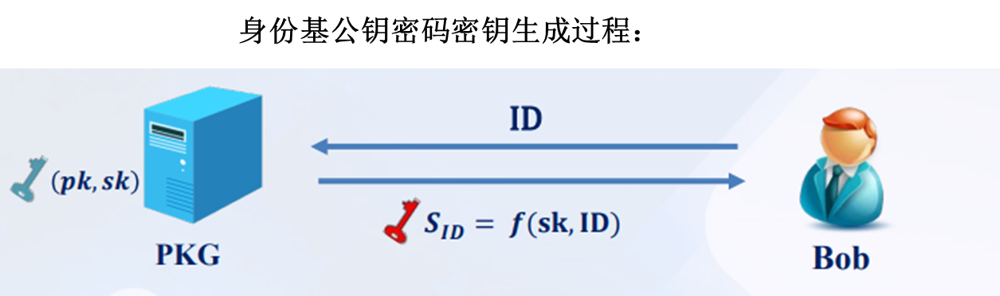
   - 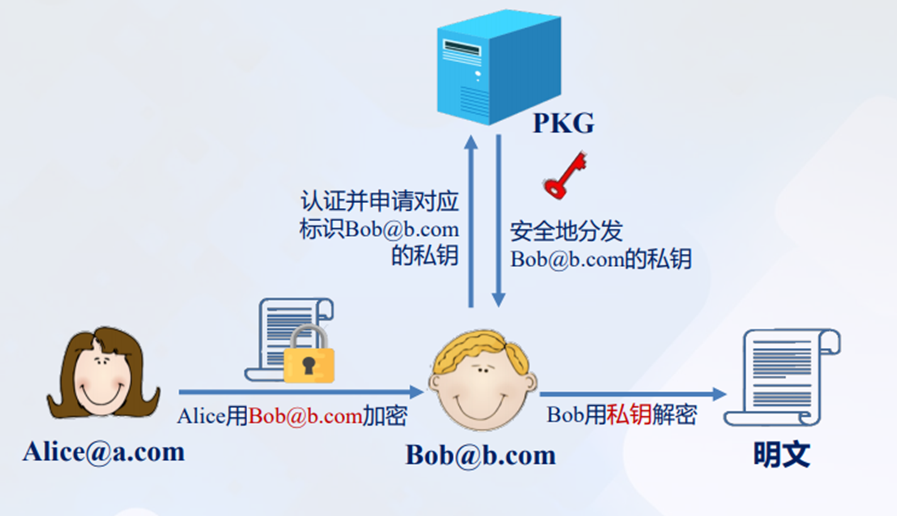
   - (pk,sk)：用户的公私钥对
   ID：用户的公钥身份字符串
   PKG：私钥生成中（PrivateKeyGenerator ）
   - 一个身份基加密方案包含四个算法：
     - 系统建立算法：PKG生成系统公开参数和主密钥；
     - 密钥提取算法：用户将ID提交给PKG，PKG生成ID对应的私钥；
     - 加密算法：利用用户身份ID加密消息，生成加密密文；
     - 解密算法：利用身份ID对应的私钥解密密文，得到明文消息。
   - 身份基加密方案扩展了身份基公钥密码体制，能够较好地解决PKI证书管理复杂问题，被广泛应用于安全电子邮件、AdHoc网络密钥管理等应用场景。
   - 优点：
     - 无需公钥证书，加密或签名验证不需要知道除身份外的其他信息；
     - 无需证书机构，存在可信第三方私钥生成中心(PKG)向用户提供服务；
   - 缺点：
     - 密钥托管问题：恶意的PKG可能存储用户私钥的副本，使其有能力解密任何一个用户发送给用户ID的密文或伪造用户ID的数字签名。

4. **属性基公钥密码 (ABE)**
   - 数据拥有者根据用户的属性来加密数据，并且只有当用户拥有特定属性组合时才能解密数据，这种加密方式为数据共享和访问控制提供了一种细粒度的控制机制。
   -  在属性基加密中，系统的每个权限都可以用一个**属性**来表示。系统中存在一个属性权威( Attribute Authority，AA)，属性权威对每个用户的属性进行认证，并颁发相应密钥。
   - 密钥和密文都与**一组属性**相关联，属性集合表示用户身份。加密者根据将要加密的消息和接收者的属性构造一个**加密策略**，当属性满足加密策略时，解密者才能够解密。
   - 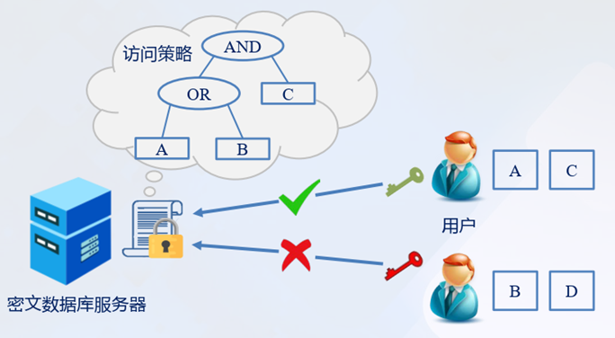
   - 属性基签名（Attribute-Based Signature，ABS）是由模糊身份签名发展而来的；
     - 根据签名的生成过程分为：密钥策略属性基签名（KP-ABS）、签名策略属性基签名（SP-ABS）
     - 当且仅当属性集合满足访问结构时，签名者可以对消息生成合法签名
     - 特点：匿名性  

### 同态密码
1. **同态密码**
   - 同态密码可以在不泄露敏感信息的前提下完成对密文的处理，成为保护数据安全，提高密文处理分析能力的关键技术。
   - 同态是一个数学概念，如果E(f(a， b)) = f(E(a)， E(b))，则E(.)是一个同态映射。
   - 假设加密操作为E(.)，明文为m，密文为e，如果针对明文的操作f，可以根据E构造出f，使得 E(f(m)) = f(e)。 那么E就是一个针对f的同态加密算法。
   - 同态加密是指在不知道解密算法和密钥情况下，可以对密文直接进行特定运算，而其运算结果解密后与用明文进行相同运算所得的结果一致。

2. **同态密码技术的优缺点**
   - 优点：无密钥方的计算处理，既可以减少通信代价，又可以避免每一个密文解密后再计算而花费高昂的计算代价。
   - 缺点：
     - 只能实现单比特加密，效率较低；
     - 困难性假设未论证，寻找可论证的困难问题是个难题；
     - 需要额外的消除噪音算法，依然不是自然同态。
   

### 抗量子密码
1. **抗量子密码分类**
   - 基于量子物理学的量子密码：
     - 主要集中在量子密钥分配、量子秘密共享、量子认证、量子密码算法和量子密码算法的安全性等方面的研究；
     - 安全性是基于**量子物理设备**的。
   - 基于生物学的DNA密码：
     - 是随着基因工程和生物计算的发展而诞生的；
     - 安全性是建立在**生物困难问题**上的。
   - 基于数学的抗量子计算密码;
     - 基于量子计算机不擅长计算的**数学困难问题**构造的；
     - 研究方向主要有：基于格的密码、基于Hash的数字签名、基于纠错编码的密码和基于多变量的密码。

2. **基于数学的抗量子密码**
   - NIST PQC 标准征集工作聚焦于以下3类抗量子密码算法的征集：加密、密钥交换、数字签名。
   - 在 69 个候选草案中，主要包括以下 4 种数学方法构造的抗量子密码算法：
     - **格 (Lattice-based)**：
       - 最早出现于 1996 年，主要用于构造加密、数字签名、密钥交换，以及众多高级密码学应用，如：**属性加密 (Attribute-based encryption)**、陷门函数 (Trapdoor functions)、伪随机函数 (Pseudorandom functions)、同态加密 (Homomorphic Encryption) 等。代表算法：NTRU 系列、NewHope 、一系列同态加密算法 (BGV、GSW、FV 等)。由于其计算速度快、通信开销较小，且能被用于构造各类密码学算法和应用，因此被认为是**最有希望的抗量子密码技术**
     - **编码 (Code-based)**：
       - 最早出现于 1978 年，主要用于构造加密算法。代表算法：McEliece
     - **多变量 (Multivariate-based)**：
       - 最早出现于 1988 年，主要用于构造数字签名、加密、密钥交换等。代表算法：HFE (Hidden Field Equations)、Rainbow (Unbalanced Oil and Vinegar (UOV) 方法)、HFEv- 等
     - **哈希 (Hash-based)**：
       - 最早出现于 1979 年，主要用于构造数字签名。代表算法：Merkle 哈希树签名、XMSS、Lamport 签名等
   

### 轻量级密码
1. 轻量级密码概述
   - 轻量级密码的特性
     - 目标：为资源受限的设备定制专属的密码解决方案；
     - 特点：对吞吐率的要求比普通密码算法低；
     - 实用性：部分轻量密码采用机器内置密钥。
   - 轻量级密码的设计方法实现
     - 设计要求：存储计算开销小、能耗低、安全性；
     - 第一种方法：在现有的密码方案上进行轻量化改进；
     - 第二种方法：设计一个全新的轻量密码方案。
   - 轻量级密码的性能评估
     - 硬件开销：延迟、功耗、吞吐率
     - 软件开销：寄存器、RAM、ROM的空间使用
     
2. 轻量级密码研究现状 
     
### 密码学主要研究方向
1. 研究方向
   - 密码学是研究密码编码、密码分析、密码工程、密码应用、密码管理、密码安全防护等问题的一门科学，是多个学科融合形成的交叉学科。
   - 