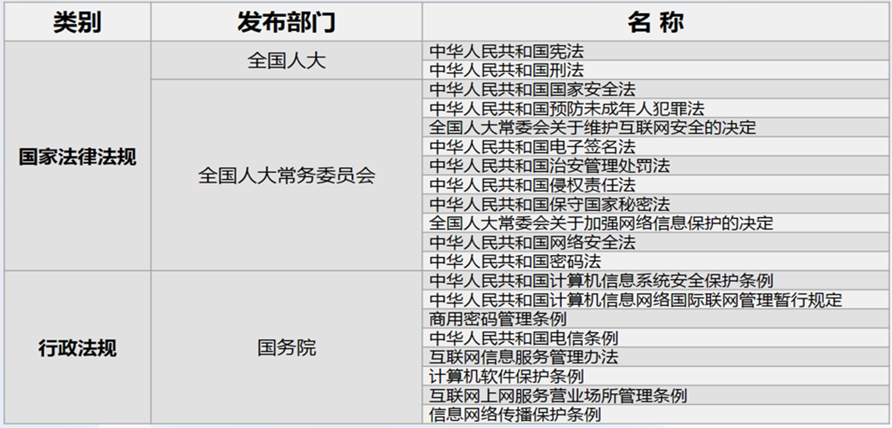
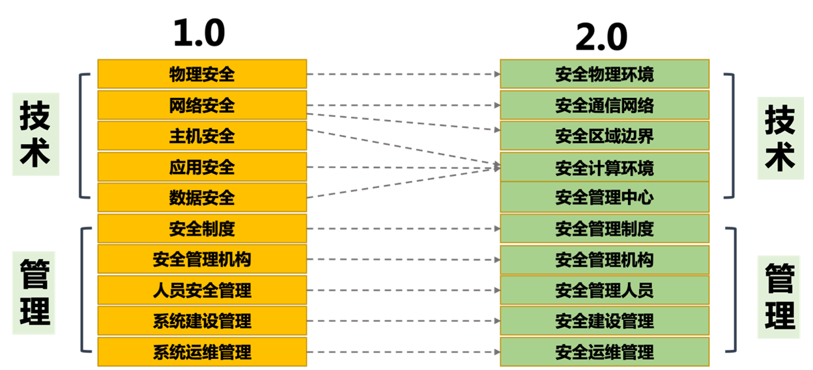
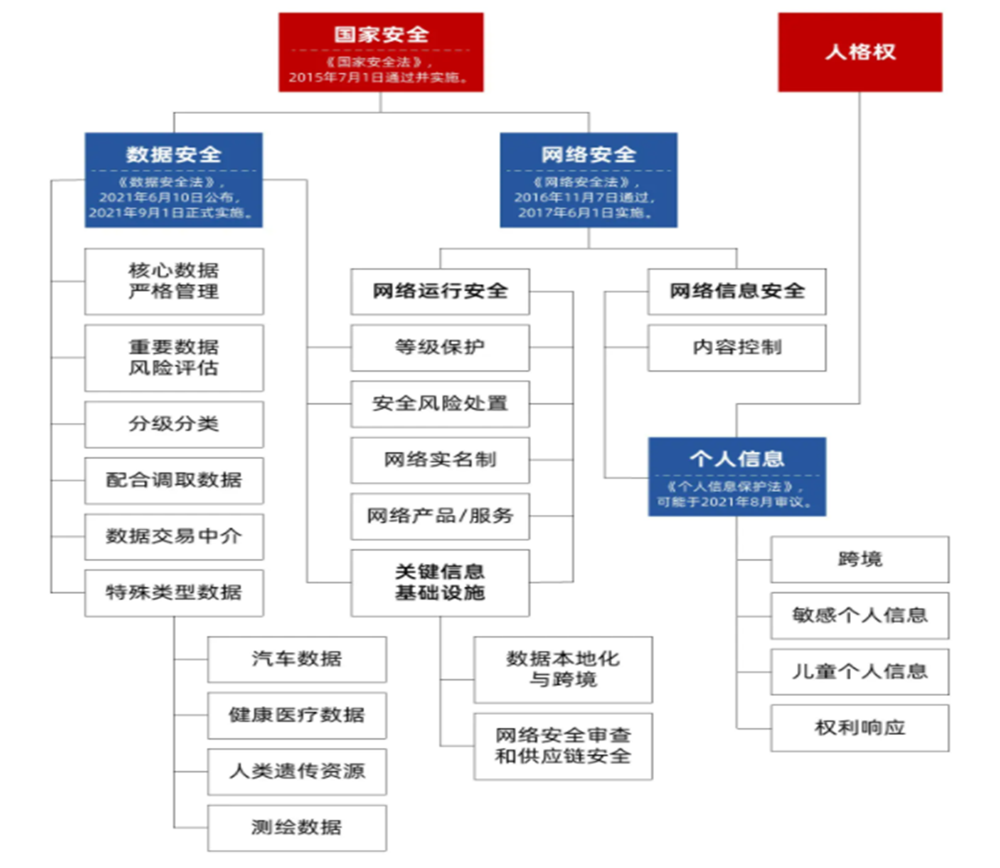

# 第一章 网络空间安全概述

## 第一节 信息时代及信息安全

### 网络空间安全-初步接触

信息时代特征

1. 新摩尔定律
2. 吉尔德定律
3. 千倍定律

### 当前网络信息安全态势

1. **信息技术与产业空前繁荣**
2. **量子信息技术高速发展**
3. **信息安全形势严峻，危机四伏的网络世界**
4. **敌对势力破坏**
5. **黑客组织攻击**
6. **计算机病毒入侵**
7. **利用计算机进行经济犯罪**
8. **有害内容泛滥、隐私保护问题严重**
9. **网络安全形式严峻**
    - 信息战 网络战
    - 网络空间安全对抗愈益加剧
    - 信息技术对信息安全的挑战
10. **国家对信息安全的重视**

### 网络信息安全发展趋势

1. 网络信息安全已成为关系社会、文化、经济、军事乃至国家安全的重大战略问题。
    - 网络信息安全成为重大战略问题，涉及国家安全各方面，网络犯罪造成巨大经济损失，美国成立网络司令部加强网络空间争夺。
2. 网络安全威胁层出不穷，网络关键基础设施隐患重重
。
    - 网络安全威胁不断，关键基础设施受攻击影响重大，黑客攻击针对性增强，恶意代码增长迅速。
3. 网络空间国家间的竞争与合作日趋凸显。
    - 网络空间国家间竞争合作凸显，“军备竞赛”开始，多国组建网络战部队，斯诺登事件引发网络空间新型对抗。
4. 国际互联网治理领域迎来新热潮，信息资源保护成为各国焦点
    - 国际互联网治理成热潮，信息资源保护受关注，网络基础设施漏洞威胁全球，各国重视互联网治理权。

## 第二节 法律法规及标准概述

### 学科内涵

- **网络空间安全的定义与内涵**

  - 网络空间是信息时代人类赖以生存的信息环境，是所有信息系统的集合。它以计算机和网络系统实现的信息化为特征。
  - 网络空间是人的生存环境，也是信息的生存环境。
  - 网络空间安全研究网络空间中安全威胁与防护问题。
  - 核心内涵为信息安全。

- **信息的安全属性—C.I.A三要素**
  - **机密性**是指保证信息与信息系统不被非授权者截获和未经授权使用。
  - **完整性**是指信息是完整的，真实的、未被篡改的、正确的。
  - **可用性**是指信息与信息系统服务可被授权人正常使用
  - 其它基本要素：非否认性、可控性

- **信息系统安全层次结构**
  - **设备安全**：信息系统设备的安全是是信息系统安全的物质基础，是信息系统安全的首要问题，软硬件系统的安全（稳定、可靠、可用）
  - **行为安全**：主体行为的过程和结果来考察是否会危害信息安全，数据安全本质上是一种静态的安全，而行为体现在过程和结果之中，行为安全是一种动态安全。
  - **数据安全**：数据免受未授权的泄露、篡改和毁坏。数据安全本质上是一种静态的安全，而行为体现在过程和结果之中，行为安全是一种动态安全。
  - **内容安全**：信息安全在政治、法律、道德层次上的要求，是语义层次的安全，内容安全还包括信息内容保密、知识产权保护、信息隐藏和隐私保护等诸多方面

- **信息安全三大定律**
  - 普遍性定律指出有信息就有安全问题；
  - 折中性定律表明安全与方便是矛盾体；
  - 就低性定律说明系统安全性取决于最薄弱部分（木桶原理）。
  
- **网络空间安全学科定义**
  - 网络空间安全学科是研究信息获取、信息存储、信息传输和信息处理领域中信息安全保障问题的一门新兴学科。
  
- **理论基础**
  - 数学：数论、代数、组合数学、概率统计等数学分支，是密码学的理论基础
  - 逻辑学是网络协议安全基础：协议是网络的核心，协议安全是网络安全的核心。
  - 博弈论是网络空间安全特有理论
  - 信息论、控制论和系统论是现代科学的理论基础：信息论是密码学和信息隐藏基础，系统论核心是整体观念，控制论体现于信息安全PDR策略。

- **方法论基础**
  - 以解决网络空间安全问题为目标、以适应网络空间安全需求为特征的具体科学方法论
  - **逆向分析**是网络空间安全学科特有的方法论，该学科领域斗争具攻防对抗性
  - 方法论的应用：强调底层性、系统性，综合治理追求整体效能，坚持“以人为核心”，注重定性定量分析相结合。

### 立法现状

1. **国际立法现状**
    - 美国通过多部法律，如信息自由法等，还有总统令及相关法案；俄罗斯颁布联邦信息相关法律；欧盟建立一系列法律，如数据保护法等，近年通过网络安全相关指令和条例。
2. **我国立法现状**
    - 早期我国计算机信息安全立法属“渗透型”，将相关规范融入其他法律法规，初步形成法律规范体系。现有法律法规众多，包括国务院令发布的条例、全国人大通过的决定、网络安全法等一系列法律，还有部门规范如计算机信息网络国际联网安全保护管理办法等。
    - 
3. **我国立法不足与体系**
    - 我国立法存在规范需完善升级、部分应用缺法律支持、执法需高技术支撑等问题，立法体系涵盖法律、行政法规、部门规章等不同层次。

### 计算机犯罪有关刑法条款

1. **相关法律条款发展历程**
    <!-- - 随着计算机技术发展，计算机犯罪相关法律条款不断演进，经历多次刑法修正案完善，包括对计算机信息系统的非法侵入、控制，对系统功能、数据和程序的破坏，以及利用计算机实施的各类犯罪等方面的规定。 -->
2. **具体刑法条款内容**
    <!-- - 如《刑法》第二百八十五条规定了非法侵入特定计算机信息系统及获取数据、非法控制的刑罚；第二百八十六条规定了对计算机信息系统功能、数据和程序进行破坏以及制作传播病毒的刑罚；第二百八十七条规定利用计算机实施其他犯罪依照相关规定定罪处罚。此外，还有《全国人民代表大会常务委员会关于维护互联网安全的决定》对互联网运行安全、国家安全、市场经济秩序等方面的刑事责任作出规定，以及《中华人民共和国计算机信息系统安全保护条例》确立了信息系统安全保护的多项制度，包括等级保护、机房标准、联网备案等，同时对违反规定的行为设定了相应处罚措施。 -->

### 标准的基本知识

1. **标准的定义与分类**
    - 标准是通过标准化活动，按照规定的程序协商一致制定，为各种活动或其结果提供规则、指南或特性，供共同使用和重复使用的文件。
    - 《中华人民共和国标准化法》将标准划分为：**国家标准、行业标准、地方标准和企业标准**
    - 国家标准、行业标准均可分为：**强制性和推荐性**两种属性的标准。强制性国家标准代号：GB，推荐性国家标准代号：GB/T
    - 标准、规范、规程都是标准的一种表现形式,习惯上统称为标准。
2. **国际标准化组织**
    - 国际电工委员会（IEC）是最早的国际性电工标准化组织；国际标准化组织（ISO）及其从事信息安全标准化工作的分技术委员会（SC27）；互联网工程任务组（IETF）也在相关领域发挥作用。
3. **我国标准化组织**
    - 全国信息安全标准化技术委员会（信安标委）负责全国信息安全标准化工作；密码行业标准化技术委员会（密标委CSTC）负责密码领域标准化工作。

### 信息安全标准

1. **涉密信息系统分级保护管理办法**
    - 涉密信息系统分级保护依据涉密程度分为**秘密级、机密级、绝密级**，**国家保密局**是涉密信息系统分级保护工作的主管部门。

2. **信息系统等级保护基本要求**
    - 信息安全等级保护的核心是分级及保护
    - 信息系统安全等级保护的内容可分为**系统定级、系统备案、测评、监督检查**五个方面
    - 信息系统的分级主要是依据对国家、社会、法人及组织的损害程度及范围来确定的。损害小、范围也小的，级别低、保护要求也低；损害大、范围大的，级别高，保护的要求就相应增加
    - 等级保护1.0 vs 2.0
      - 安全分类变化：
      - 标准名称变化：信息安全等级保护基本要求 -》网络安全等级保护基本要求
      - 等级保护对象变化：信息系统 -》增加云计算平台、大数据平台、移动互联、物联网和工业控制系统等要求
      - 安全要求变化：安全要求 -》安全通用要求+安全扩展要求
      - 安全管理中心：2.0在二级及以上增加了“安全管理中心”
      - 可信验证：2.0在多个技术环节增加了“可信验证”控制点

3. **商用密码标准**
    - 商用密码的行业标准分为基础类标准、应用类标准、检测类标准和管理类标准。
    - 基础类标准为其他三类标准提供了底层、共性支撑（如术语、算法、协议、产品等）；
    - 应用类标准为上层具体的密码产品、服务应用提供支持；
    - 检测类标准为基础类标准和应用类标准提供了合法性检测的功能，保障商用密码使用的合法性；
    - 管理类标准为其他三类标准提供了管理功能；
    - 我国多个商用密码算法成为国际标准，如SM2、SM3、SM4、SM9和ZUC算法等，ZUC（祖冲之）算法还被3GPP采纳为国际标准并成为国家和行业标准。

## 第三节 保密法及密码法

### 保密法概述
1. **保密法历史**
   - 1951年6月8日，周恩来总理签署中央人民政府政密字377号命令，公布实行《保守国家机密暂行条例》。
   - 1988年9月5日，第七届全国人民代表大会常务委员会第三次会议审议通过了《中华人民共和国保守国家秘密法》，自1989年5月1日起实行。
   - 2010年4月29日，第十一届全国人民代表大会常务委员会第十四次会议修订通过《中华人民共和国保守国家秘密法》，自2010年10月1日起施行。
   - 最新修订在2024年2月27日，由第十四届全国人民代表大会常务委员会第八次会议通过，自2024年5月1日起施行。

2. **保密法结构**
   - 《中华人民共和国保守国家秘密法》共六章65条。
   - 包括总则、国家秘密的范围和密级、保密制度、监督管理、法律责任和附则。

### 保密法内容解读
1. **一些案例**
   <!-- - 2003年铁矿石交易事件导致中国经济损失高达7000亿人民币。
   - 2009年7月5日，胡士泰等四名力拓员工因侵犯商业秘密罪、非国家工作人员受贿罪被刑事拘留。
   - GoogleEarth地球服务暴露了许多国家的政府大楼、军事设施以及敏感地点。
   - 1964年《中国画报》封面刊出的照片泄露了大庆油田的位置、储量和产量。
   - 2016年，俄罗斯士兵手机拍照泄露了航母“库兹涅佐夫”号内机库细节。 -->

2. **国家秘密及范围**
   - 国家秘密是关系国家安全和利益，依照法定程序确定，在一定时间内只限一定范围的人员知悉的事项。
   - 包括国家事务、国防建设、外交外事、国民经济和社会发展、科学技术、国家安全活动和追查刑事犯罪等事项。

3. **国家秘密的范围及密级**
   - 条 国家秘密及其密级的具体范围，即保密事项范围，由国家保密行政管理部门单独或会同有关中央国家机关规定。
   - 国家秘密的密级分为**绝密、机密、秘密**三级。
   - 国家秘密的保密期限，应当根据事项的性质和特点，按照维护国家安全和利益的需要，限定在必要的期限内；不能确定期限的，应当确定解密的条件。
   - 国家秘密的保密期限，除另有规定外，绝密级不超过三十年，机密级不超过二十年，秘密级不超过十年。

4. **保密制度**
   - 国家秘密载体的制作、收发、传递、使用、复制、保存、维修和销毁应符合国家保密规定。
   - 存储、处理国家秘密的计算机信息系统应实行**分级保护**，并配备保密设施、设备。

5. **涉密人员管理**
   - 涉密人员按照涉密程度分为**核心涉密人员、重要涉密人员和一般涉密人员**，实行分类管理。
   - 涉密人员离岗离职应当遵守国家保密规定。机关、单位应当开展保密教育提醒，清退国家秘密载体，**实行脱密期管理**。

6. **涉密计算机和涉密载体保密管理**
   - 加强对信息系统、信息设备的保密管理，建设保密自监管设施。
   - 加强对国家秘密载体的管理，禁止非法获取、持有、买卖、转送或私自销毁国家秘密载体。

7. **12种违规行为**
   - （一）非法获取、持有国家秘密载体的；
   - （二）买卖、转送或者私自销毁国家秘密载体的；
   - （三）通过普通邮政、快递等无保密措施的渠道传递国家秘密载体的；
   - （四）寄递、托运国家秘密载体出境，或者未经有关主管部门批准，携带、传递国家秘密载体出境的；
   - （五）非法复制、记录、存储国家秘密的；
   - （六）在私人交往和通信中涉及国家秘密的；
   - （七）未按照国家保密规定和标准采取有效保密措施，在互联网及其他公共信息网络或者有线和无线通信中传递国家秘密的；
   - （八）未按照国家保密规定和标准采取有效保密措施，将涉密信息系统、涉密信息设备接入互联网及其他公共信息网络的；
   - （九）未按照国家保密规定和标准采取有效保密措施，在涉密信息系统、涉密信息设备与互联网及其他公共信息网络之间进行信息交换的；
   - （十）使用非涉密信息系统、非涉密信息设备存储、处理国家秘密的；
   - （十一）擅自卸载、修改涉密信息系统的安全技术程序、管理程序的
   - （十二）将未经安全技术处理的退出使用的涉密信息设备赠送、出售、丢弃或者改作其他用途的；
   - （十三）其他违反本法规定的情形。

8. **法律责任**
   <!-- - 违反本法规定，发生重大泄密案件的，对直接负责的主管人员和其他直接责任人员给予处分。 -->

### 密码法概述
1. **密码重要性**
   - 密码是党和国家的“命门”、“命脉”，是国家重要战略资源。密码工作是党和国家的一项特殊重要工作，直接关系国家政治、经济、国防和信息安全。
   
2. **密码法发展历程**
   - 1999年国务院颁布《商用密码管理条例》，2005年国家密码管理局正式成立。
   - 2019年10月26日，《中华人民共和国密码法》通过，习近平主席签署第35号主席令予以公布。
   - 密码法的颁布实施，是我国密码发展史上具有里程碑意义的大事，有助于提升我国密码工作的规范化、科学化、法治化水平：一是规范密码应用和管理，促进密码事业发展；二是保障网络与信息安全，维护国家安全和社会公共利益，保护公民、法人和其他组织的合法权益。
   - 对维护我国网络空间安全、促进信息化发展具有重要意义，也直接关系企业商业秘密的依法保护，关系社会公众在网络空间生活的安全和便利。

3. **密码的应用**
   - 区块链技术是分布式账本技术，核心是密码技术。
   - 增值税防伪税控系统采用商用密码技术保护涉税信息，减少税收流失。

### 密码法内容解读
1. **中华人民共和国密码法内容**
   - 《中华人民共和国密码法》自2020年1月1日起施行，共五章44条。
   - 密码是国家重要战略资源，是保障网络与信息安全的核心技术和基础支撑。
   - 1. 什么是密码
     -  “是指采用特定变换的方法对信息等进行加密保护、安全认证的技术、产品和服务”
     -  核心密码用于保护国家绝密级、机密级、秘密级信息
     -  普通密码用于保护国家机密级、秘密级信息
     -  商用密码用于保护不属于国家秘密的信息
     -  对密码实行分类管理，是党中央确定的密码管理根本原则，是保障密码安全的基本策略
   - 2. 谁来管密码
     - 坚持党管密码根本原则
     - 中央密码工作领导小组（国家密码管理委员会），对全国密码工作实行统一领导
     - 国家、省、市、县四级密码工作管理体制
   - 3. 怎么管密码
     - 第二章（第十三条至第二十条）规定了核心密码、普通密码的主要管理制度：密码管理部门依法对核心密码、普通密码实行严格统一管理，并规定了核心密码、普通密码使用要求安全管理制度以及国家加强核心密码、普通密码工作的一系列特殊保障制度和措施。核心密码、普通密码本身就是国家秘密，一旦泄密，将危害国家安全和利益
     - 第三章（第二十一条至第三十一条）规定了商用密码的主要管理制度：商用密码的主要管理制度，包括商用密码标准化制度、检测认证制度、市场准入管理制度、使用要求、进出口管理制度、电子政务电子认证服务管理制度以及商用密码事中事后监管制度
   - 4. 怎么用密码
     - 第十四条要求在有线、无线通信中传递的国家秘密信息，以及存储、处理国家秘密信息的信息系统，应当依法使用核心密码、普通密码进行加密保护、安全认证
     - 第八条规定公民、法人和其他组织可以依法使用商用密码保护网络与信息安全，对一般用户使用商用密码没有强制性要求
     - 为了保障关键信息基础设施安全稳定运行，维护国家安全和社会公共利益，第二十七条要求关键信息基础设施必须依法使用商用密码进行保护
     - 党政机关存在大量的涉密信息、信息系统和关键信息基础设施，都必须依法使用密码进行保护

1. **商用密码标准体系**
   - 国家建立和完善商用密码标准体系，推进商用密码检测认证体系建设。
   - 商用密码检测、认证机构应当依法取得相关资质，并依照法律、行政法规的规定和商用密码检测认证技术规范、规则开展商用密码检测认证。

2. **商用密码产品**
   - 涉及国家安全、国计民生、社会公共利益的商用密码产品，应列入网络关键设备和网络安全专用产品目录。
   - 商用密码产品检测认证适用《中华人民共和国网络安全法》的有关规定，避免重复检测认证。

3. **法律责任**
   - 违反密码法规定的行为，将依法追究法律责任。

## 第四节 网络安全法

### 网络安全立法背景
1. **全球性问题**
   - 应对网络安全威胁已是全球性问题，国际网络安全的法治环境正发生巨大变革。
   - 美欧等网络强国纷纷建立全方位、立体化、更具弹性与前瞻性的网络安全立法体系。
   - **网络安全立法已演变为全球范围内的国家主权与利益的斗争，有法可依成为了谈判与对抗的必要条件。**

2. **国际背景**：合作与共赢、冲突与对抗

3. **国内背景**
   - 网络安全人才建设滞后，人才缺乏。
   - 大量网络安全事件和经济损失。
   - 新技术持续发展与应用。
   - 地下黑产不断扩大，网络攻击频繁发生。
   - 我国信息化建设的突飞猛进。
   - 法律法规条纹分散、监管滞后。
  
4. **网络安全事件特点**
   - 目标明确：
     - 信息安全事件大多为敌对国家或利益集团为达到某种目的而发起的网络攻击。往往是向指定的目标发起特定的网络攻击，具有极强的针对性。
   - 隐蔽性强：
     - 攻击工业控制系统的病毒和黑客，异常熟悉工业控制系统的网络情况，攻击方法独特导致无法及时发现，具有极强的隐蔽能力，可以长时间隐藏于工业控制系统中。
   - 破坏严重：
     - 电力、能源、金融等系统如果遭到破坏，轻则造成经济损，重则会造成人身伤亡，甚至会影响地区和国家的安定，乃至国家战略和重大计划的执行都会受到阻挠。

5. **网络安全立法的需求**
6. **国外网络安全立法状况**
7. **网络空间安全顶层设计**
8. **国家高度重视**
9. **立法进程**

### 网络安全法的重大意义
1. **立法里程碑**
   - 《网络安全法》的出台具有里程碑式的意义，是全面落实党的十八大和十八届三中、四中、五中、六中全会相关决策部署的重大举措。
   - 我国**第一部网络安全的专门性综合性立法**，提出了应对网络安全挑战这一全球性问题的中国方案。
   - 立法进程的快速推进，显示了党和国家对网络安全问题的高度重视，是我国网络安全法治建设的一个重大战略契机。
   - 网络安全有法可依，信息安全行业将**由合规性驱动过渡到合规性和强制性驱动并重**。   

2. **服务与国家网络安全战略和网络强国建设**
   - 网络空间逐步成为世界主要国家展开竞争和战略博弈的新领域。确立网络空间行为准则和模式已是当务之急。
   - 《网络安全法》中明确提出了有关国家网络空间安全战略和重要领域安全规划等问题的法律要求，这有助于实现推进中国在国家网络安全领域明晰战略意图，确立清晰目标，厘清行为准则，不仅能够提升我国保障自身网络安全的能力，还有助于推进与其他国家和行为体就网络安全问题展开有效的战略博弈。

3. **助力网络空间治理，护航“互联网+”**
   - 我国是名符其实的网络大国，但现实的网络环境十分堪忧。
   - 《网络安全法》将成为新的起点和转折点。

4. **构建我国首部网络空间管辖基本法**
   - 《网络安全法》属于国家基本法律，是网络安全法制体系的重要基础。
   - 《网络安全法》规定了信息安全法的总体目标和基本原则；规范网络社会中不同主体所享有的权力义务及其地位；建立网站身份认证制度，实施后台实名；建立网络信息保密制度，保护网络主体的隐私权；建立行政机关对网络信息安全的监管程序和制度，规定对网络信息安全犯罪的惩治和打击；规定具体的诉讼救济程序等等。
   - 《网络安全法》的出台从根本上填补了**我国综合性网络信息安全基本大法**、核心的网络信息安全法和专门法律的三大空白。   

5. **提供维护国家网络主权的法律依据**
   - 我国在2016年7月推出了《国家安全法》，首次以法律的形式明确提出了“维护国家网络空间主权”。
   - 《网络安全法》是《国家安全法》在网络安全领域的体现和延伸，为我国维护网络主权、国家安全提供了最主要的法律依据。
   

6. **在网络空间领域贯彻落实依法治国精神**
   - 十八届四中全会通过了《中共中央关于全面推进依法治国若干重大问题的决定》。
   - 《网络安全法》则开启了依法治网的崭新局面，成为依法治国顶层设计下一项共建共享的路径实践。
   - 依法治网成为我国网络空间治理的主线和引领，依法治谋求网治的长治久安。

7. **成为网络参与者普遍遵守的法律准则和依据**
   - 《网络安全法》的执行，成为各方参与互联网上的行为提供非常重要的准则。
   - 《网络安全法》对网络产品和服务提供者的安全义务有了明确的规定，将现行的安全认证和安全检测制度上升成为了法律

### 网络安全法概览及亮点
1. **概览**
   - 《网络安全法》亮点包括：
     - 监测预警与应急处置措施的制度化、法制化
     - 明确了网络空间主权的原则
     - 建立了关键信息基础设施安全保护制度
     - 明确了网络产品和服务提供者的安全义务
     - 进一步完善了个人信息保护规则
     - 明确了网络运营者的安全义务
2. **亮点**
   - 全面性：
     - 全面和系统地确立了各个主体包括国家有关主管部门、网络运营者、网络使用者在网络安全保护方面的义务和责任；
     - 确立了保障网络的设备设施安全、网络运行安全、网络数据安全以及网络信息安全等方面的基本制度。
   - 针对性：
     - 从我国的国情出发，坚持问题的导向，总结实践经验，也借鉴了其他国家的一些做法，建立保障网络安全的各项制度，重在管用，重在解决实际问题
   - 协调性：
     - 始终坚持安全与发展并重的原则，协调推进网络安全和发展，注重保护网络主体的合法权益，保障网络信息依法、有序、自由的流动，促进网络技术创新，最终实现以安全促发展，以发展来促安全的目的。    

### 网络安全法重要条款解读
1. **第一章 总则**
   - 描述制定网络安全法的目的和适用范围，保障网络安全的目标以及各部门、企业、个人所承担的责任义务，并强调将大力宣传普及，加快配套制度建设，加强基础支撑力量建设，确保网络安全法有效贯彻实施。

1. **第二章 网络安全支持与促进**
   - 要求政府、企业和相关部门通过多种形式对企业和公众开展网络安全宣传教育，提高安全意识。鼓励企业、高校等单位加强对网络安全人才的培训和教育，解决目前网络安全人才严重不足问题。另外鼓励和支持通过创新技术来提升安全管理，保护企业和个人的重要数据。

2. **第三章 网络运行安全**
   - 特别强调要保障关键信息基础设施的运行安全。安全是重中之重，与国家安全和社会公共利益息息相关。《网络安全法》强调在网络安全等级保护制度的基础上，对关键信息基础设施实行重点保护，明确关键信息基础设施的运营者负有更多的安全保护义务，并配以国家安全审查、重要数据强制本地存储等法律措施，确保关键信息基础设施的运行安全。

3. **第四章 网络信息安全**
   - 从三个方面要求加强网络数据信息和个人信息的安全：第一是要求网络运营者对个人信息采集和提取方面采取技术措施和管理办法，加强对公民个人信息的保护，防止公民个人信息数据被非法获取、泄露或者非法使用；第二、赋予监管部门、网络运营者、个人或组织的职责和权限并规范网络合规行为，彼此互相监督管理；第三在有害或不当信息发布和和传输过程中分别对监管者、网络运营商、个人和组织提出了具体处理办法。

4. **第五章 监测预警与应急处置**
   - 将监测预警与应急处置工作制度化、法制化，明确国家建立网络安全监测预警和信息通报制度，建立网络安全风险评估和应急工作机制，制定网络安全事件应急预案并定期演练。这为建立统一高效的网络安全风险报告机制、情报共享机制、研判处置机制提供了法律依据，为深化网络安全防护体系，实现全天候全方位感知网络安全态势提供了法律保障。

5. **第六章 法律责任**
   - 规定了违反网络安全法的法律责任，包括行政处罚、民事责任、治安管理处罚和刑事责任。
     - 行政处罚：责令改正、警告、罚款，有关机关还可以把违法行为记录到信用档案，对于     “非法入侵”等，法律还建立了职业禁入的制度。 
     - 民事责任：违法《网络安全法》的行为给他人造成损失的，网络运营者应当承担相应的民事责任。
     - 治安管理处罚/刑事责任：违反本法规定，构成违反治安管理行为的，依法给予治安管理处罚；构成犯罪的，依法追究刑事责任。

## 第五节 数据安全法

### 立法背景
1. **国内外背景**
   - 数据价值凸显：随着5G、IoT、AI等信息技术革命的推进，数据量进入ZB级别，数据成为数字经济发展的新生产要素。
   - 数据泄露事件频发：如美国棱镜事件、Facebook数据泄漏事件等，引发全球对数据安全的关注。
   - 经济利益与数据安全发生冲突：数据跨境流动的隐蔽性削弱国家对本国数据的控制，危及数据主权。
   - 国内外相关法律法规：巴西、欧盟、美国等国家和地区已制定数据安全和隐私保护法律。

### 立法意义
1. **规范数据处理，保护合法权益**
   - 规范数据活动，保障数据安全，促进数据开发利用，保护个人、组织的合法权益，维护国家主权、安全和发展利益。
2. **对数据的有效监管实现有法可依、填补数据安全保护立法的空白**
   - 《数据安全法》构成了数字经济时代的法治基石，是构建国家安全法律制度体系的重要举措，有助于提高我国应对数据风险与挑战的能力。
3. **提升国家数据安全保障能力**
   - 随着新技术的使用，全场景、大规模的数据应用对国家安全造成严重威胁，数据安全是国家安全的重要组成部分，通过法律的立法和实施，可以有效提升数据安全的保障能力。- 为我国数字化转型的健康发展提供法治保障，为构建智慧城市、数字政务、数字社会提供法律依据。
   - 《数据安全法》进一步提升了国家数据安全保障体系和能力建设，推动形成安全有序、公正合理的数据治理新格局，切实全面维护国家主权、安全和发展利益。
4. **激活数字经济创新，提升数据利用价值**
   - 数据作为关键生产要素，其自身具有很大的经济价值，法律的发布标志着国家鼓励数据依法合理有效利用。
   - 《数据安全法》的正式实施将为我国在国际数据经济市场中提供坚实有力的保障。   
5. **扩大数据保护范围**
   - 法律明确了数据的定义，包括电子数据和非电子形式的数据，这对数据安全保障的范围提出了更广泛的要求，比《网络安全法》中的数据范围有所扩大。

### 概览及特点
1. **数据安全法概况**
  - 总计7章55条，包括数据安全与发展、数据安全制度、数据安全保护义务、政务数据安全与开放等内容。
  - 
2. **主要亮点**
  - 数据安全与数字经济发展的动态化平衡
    - 提出了数据安全制度、数据安全保护义务等确保数据活动符合安全要求
    - 推动政务数据开放利用，利用数据提升公共服务智能化水平
    - 家统筹发展和安全理念
    - 数据交易制度的确立使得数据依法有序流动成为现实
  - 重视数据安全制度的建设
    - 明确提出了数据分类分级保护制度，确定重要数据具体目录，并提出了核心数据的概念。
    - 明确了数据安全风险评估、信息共享、监测预警机制、安全审查制度等，强化内控制度建设，防控数据安全风险
    - 《数据安全法》对数据的出境管理进行了补充和完善
  - 加强国家对数据安全工作的统筹
    - 明确了监管职责，确定给地区、各部门的主题责任，网信部门发挥统筹协调职能
    - 通过明确国家层面的统筹协调职能，确保后续国家数据安全战略和重大方针政策的有效落地和执行。
  - 增加对数据泄露危及国家安全的处罚力度
    - 对数据安全风险设置了基本“红线”。

### 重要条款解读
1. **扩大数据保护范坚持总体国家安全发展观**
   - 第一条确立该法的立法目的：“为了规范数据处理活动，保障数据安全，促进数据开发利用，保护个人、组织的合法权益，维护国家主权、安全和发展利益，制定本法。”
   -  规范数据处理活动的目的，是为了保障数据的安全，只有在确保数据安全的基础上，方能促进数据的有序开发和利用。
2. **我国数据保护的域外法律效力**
   - 第二条第二款明确规定：“在中华人民共和国境外开展数据处理活动，损害中华人民共和国国家安全、公共利益或者公民、组织合法权益的，依法追究法律责任。”
   -  “境外开展数据处理数据活动”的主体既包括位于中国境外的数据处理者，也包括位于中国境内的数据处理者，但其数据处理行为在境外。
   -  只要损害了我国国家安全、公共利益以及公民和组织的合法数据权益，均由我国法律管辖，并追究法律责任。
3. **促进以数据为关键要素的数字经济发展**
   - 第七条规定：“国家保护个人、组织与数据有关的权益，鼓励数据依法合理有效利用，保障数据依法有序自由流动，促进以数据为关键要素的数字经济发展。”
   -  数据作为生产要素由市场评价贡献、按贡献决定报酬，这是党的十九届四中全会首次提出的一项重大产权创新制度。
   - 在个人和组织与数据有关的权益得到充分保护的基础上，依法推动数据合理有效利用和依法有序自由流动
4. **数据可以合法交易**
   - 第十三条和第十九条明确数据的合法交易可以有效推动和促进数字经济和社会的发展。
   - 并非一味就是强调“监管”或“制约”，在保护国家安全和数据安全的前提下，可以合法交易
   - 数据的合法交易可以有效推动和促进数字经济和社会的发展
5. **国家数据分类分级保护**
   - 第二十一条规定：“国家建立数据分类分级保护制度，根据数据在经济社会发展中的重要程度，以及一旦遭到篡改、破坏、泄露或者非法获取、非法利用，对国家安全、公共利益或者个人、组织合法权益造成的危害程度，对数据实行分类分级保护。”
   -  “数据分类”，采用了数据的“重要程度”＋“危害程度”的立法手段，对数据实行分类分级保护。
   -  从国家层面提出了数据分类分级，是确定数据保护和利用之间平衡点的一个重要依据
6. **国家数据安全审查制度**
   - 第二十四条规定：“国家建立数据安全审查制度，对影响或者可能影响国家安全的数据处理活动进行国家安全审查。”
   -  数据安全审查制度与网络安全审查是依法确立的国家安全审查制度中两项重要的安全审查制度。
   -  数据安全审查制度的审查对象主要针对影响或者可能影响国家安全的数据处理活动，数据处理活动包括：数据的收集、存储、使用、加工、传输、提供、公开等。
   
7. **国家数据安全应急处置机制**
   - 第二十三条规定了“国家建立数据安全应急处置机制”，并要求“发生数据安全事件，有关主管部门应当依法启动应急预案，采取相应的应急处置措施，防止危害扩大，消除安全隐患，并及时向社会发布与公众有关的警示信息”
   -  “有关单位”应当按照“谁主管谁负责、谁运行谁负责”的原则确定
   - 采取最有效的应急处置措施，防止危害扩大，要消除安全隐患，同时要组织研判，保存证据，并做好信息通报工作
   - 及时向社会发布与公众有关的警示信息
   - 分为四级：由高到低依次用红色、橙色、黄色和蓝色标示，分别对应可能发生特别重大、重大、较大和一般网络安全突发事件。
   
8. **数据处理者的合规义务**
   - 第二十七条到第三十条明确了数据处理者履行数据安全的四项重要合规义务。
  
9. **重要数据的出境安全管理制度**
   - 第三十一条规定了关键信息基础设施的运营者在中华人民共和国境内运营中收集和产生的重要数据的出境安全管理。
   - 关键信息基础设施的运营者在中华人民共和国境内运营中收集和产生的重要数据的出境安全管理，适用《中华人民共和国网络安全法》。
   - 除关键信息基础设施的运营者处理的重要数据外，其他数据处理者在中华人民共和国境内运营中收集和产生的重要数据的出境安全管理办法，由国家网信部门会同国务院有关部门制定
   - 数据出境，要求出境前必须经过“安全评估”。
   
10. **提供数据处理服务的行政许可准入制度**
    - 第三十四条规定：“法律、行政法规规定提供数据处理相关服务应当取得行政许可的，服务提供者应当依法取得许可。”
    -  许可（license）含有准许、允许或授权的意思，数据处理相关服务的行政许可，其基本性质是行政机关对特定的数据处理服务活动事前进行控制的一种管理行为。。
    
11. **加大违法处罚力度**
    - 第四十五条对违反数据安全保护义务的组织、个人规定了严格的处罚措施。

### 个人信息保护法
1. **中华人民共和国个人信息保护法**
   - 2021年8月20日通过，2021年11月1日施行，共八章74条。
2. **立法进程**
   - 个人信息保护法的立法进程，旨在保护个人信息权益，促进个人信息合理利用。
3. **术语界定**
   - 个人信息：是以电子或者其他方式记录的与已识别或者可识别的自然人有关的各种信息，不包括匿名化处理后的信息。
   - 个人信息的处理：包括个人信息的收集、存储、使用、加工、传输、提供、公开、删除等。
   - 敏感个人信息：一旦泄露或者非法使用，容易导致自然人的人格尊严受到侵害或者人身、财产安全受到危害的个人信息，包括生物识别、宗教信仰、特定身份、医疗健康、金融账户、行踪轨迹等信息，以及不满十四周岁未成年人的个人信息。
   
4. **范围界定**
   - 境内：组织、个人再中华人民共和国境内处理自然人个人信息的活动。
   - 境外：在中华人民共和国境外处理中华人民共和国境内自然人个人信息的活动，有下列情形之一的：
     - 以向境内自然人提供产品或者服务为目的的
     - 分析、评估境内自然人的行为
     - 法律、行政法规规定的其它情形
   
5. **处理规则**
   - 规定了个人信息处理的合法、正当、必要和诚信原则，以及个人信息处理者的义务。
   - 任何组织、个人不得 非法收集、使用、加工、传输 他人个人信息，不得 非法买卖、提供或者公开 他人个人信息；不得从事 危害国家安全、公共利益 的个人信息处理活动。
   - 处理个人信息应当取得个人的同意。
   - 设专节对处理敏感个人信息作出更严格的限制
   
6. **个人信息跨境提供规则**
   - 明确了个人信息跨境提供的规则和要求。
   - 未经中华人民共和国主管机关批准，个人信息处理者不得向外国司法或者执法机构提供存储于中华人民共和国境内的个人信息。
7. **个人信息处理活动中个人的权利和处理者义务**
   - 明确了个人在个人信息处理活动中的权利，如知情权、决定权、查询权、更正权、删除权等。
8. **履行个人信息保护职责的部门**
   - 明确了个人信息保护职责部门的定义和职责。
9. **法律责任**
   - 规定了违反个人信息保护法的法律责任，包括责令改正、警告、罚款等措施。