# 第三章 网络安全基础
## 第一节 网络安全概述

### 网络安全事件回放

1. **网络的定义**
    - 定义：计算机网络是指将地理位置不同，具有**独立功能(或自治能力)** 的多个计算机系统用**通信设备和线路连接起来**，并以功能完善的网络软件(网络协议、网络操作系统等)进行信息交换，实现**资源共享和协同工作**的系统。
    - 特征：
      - 网络中包含两台以上的地理位置不同具有“自治能力”的计算机。
      - 网络中各结点之间的连接需要有一条通道，由传输介质实现物理互联。
      - 网络中各结点之间互相通信或交换信息，需要有某些约定和规则，实现各结点的逻辑互联。 
      - 计算机网络是以实现数据通信和网络资源(包括硬件资源和软件资源)共享和协作为目的。

2. **网络的结构**
    - OSI参考模型是国际标准化组织(ISO)为解决异种机互连而制定的开放式计算机网络层次结构模型，它的最大优点是将服务、接口和协议这三个概念明确地区分开来。
    - 网络通信分为七层，从下到上分别是：物理层(Physical Layer)、数据链路层(Data Link Layer，简称为链路层)、网络层(NetWork Layer)、传输层(Transport Layer)、会话层(Session Layer)、表示层(Presentation Layer)以及应用层(Application Layer)。
    - 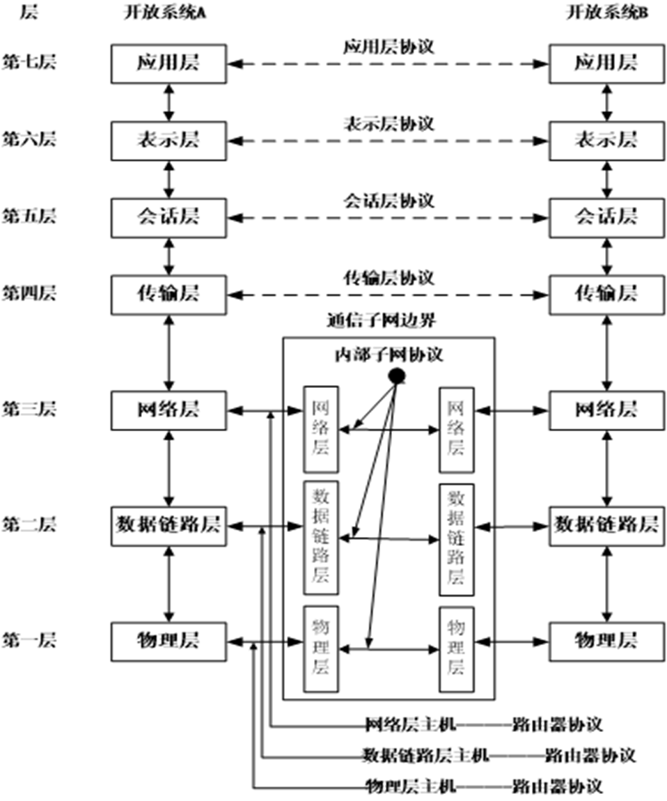

3. **网络安全现状**
   - 计算机病毒层出不穷，并呈现新的传播态势和特点
   - 黑客对全球网络的恶意攻击势头逐年攀升
   - 由于技术和设计上的不完备，导致系统存在缺陷或安全漏洞
   - 世界各国军方都在加紧进行信息战的研究

4. **网络安全事件**
<!-- 1. **海湾战争网络安全事件**
   - 1991年，美国特工人员在安曼将伊拉克从德国进口的打印机设备中换上含有可控“计算机病毒”的芯片，导致伊方计算机系统全面瘫痪。

1. **Microsoft公司网站遭袭**
   - 2000年10月25日，Microsoft公司网站遭到来自俄罗斯黑客的袭击，系统瘫痪，部分源代码丢失。

2. **中美黑客大战**
   - 2001年4月4日，美国黑客组织攻击中国网站，随后中国黑客发起网络反击战。

3. **ATM机被黑客攻击**
   - 2010年黑帽大会上，美国安全公司IOActive展示ATM机被黑客攻击，导致现金被非法取出。

4. **飞机电脑系统被黑客攻击**
   - 2013年荷兰黑客安全大会上，德国网络安全工程师Hugo Teso展示绕过飞机安全检查系统接管飞机电脑系统。

5. **特斯拉Model S系统被攻破**
   - 2014年10月黑客大赛，特斯拉Model S系统被攻破，实现远程操控。

6. **微信等苹果APP发现Xcode恶意后门**
   - 2015年9月14日，微信等近350款苹果APP发现存在Xcode恶意后门。

7. **汇丰银行遭受DDoS攻击**
   - 2016年1月4日和1月29日，汇丰银行遭受DDoS攻击，服务中断。

8. **WannaCry勒索病毒爆发**
   - 2017年5月12日，WannaCry勒索病毒利用“永恒之蓝”漏洞传播，影响超过10万台电脑。 

9.  **万豪国际酒店客户资料泄露**
    - 2018年11月30日，万豪国际酒店客户系统被黑客侵入，约5亿客户资料泄露。-->

### 网络安全威胁与防护措施
1. **网络安全概念**
   - 定义：网络安全指网络系统的硬件、软件及其系统中的数据受到保护，不因偶然的或者恶意的原因而遭受破坏、更改、泄露，系统连续可靠正常地运行，网络服务不中断。
   - 本质：网络上的信息系统安全。
   - 网络安全包括**系统安全运行**和**系统信息安全保护**两方面：
     - 信息系统的安全运行是信息系统提供有效服务(即可用性)的前提
     - 信息的安全保护主要是确保数据信息的机密性和完整性
   - 涉及内容：技术方面侧重于防范外部的入侵，管理方面则侧重于内部人为因素的管理。
   - 安全领域普遍认为“最大的漏洞就是人”。
   - 目标：**机密性、完整性、可用性、非否认性、可靠性、可控性、可审查性**

2. **安全威胁和攻击概念**
   - **安全威胁**：
     - 指对某一资源的保密性、完整性、可用性或合法使用所造成的危险。
   - 脆弱性：指在实施防护措施中或缺少防护措施时系统所具有的弱点。
   - 风险：是对某个已知的、可能引发某种成功攻击的脆弱性的代价的测度。风险分析能够提供定量的方法，以确定是否应保证在防护措施方面的投入。
   - 漏洞：从广义上讲，硬件、软件、协议的具体实现或系统安全策略以及人为因素上存在的缺陷，从而可以使攻击者能够在未经系统合法用户授权的情况下访问或破坏系统。
   - **攻击**：
     - 一种故意逃避安全服务(特别是从方法和技术上)并且破坏系统安全策略的智能行为；任何可能危及机构信息安全，破坏系统安全属性的行为；攻击就是某个安全威胁的具体实施
   

1. **网络信息安全的典型威胁**
   - 包括窃听、信息泄露、病毒感染、非法使用、完整性侵犯、拒绝服务、假冒、流量分析等。
   - 分类：
     - 物理威胁
     - 操作系统缺陷
     - 网络协议缺陷
     - 体系结构缺陷
     - 黑客程序
     - 计算机病毒

2. **典型威胁及其相互关系**
   - 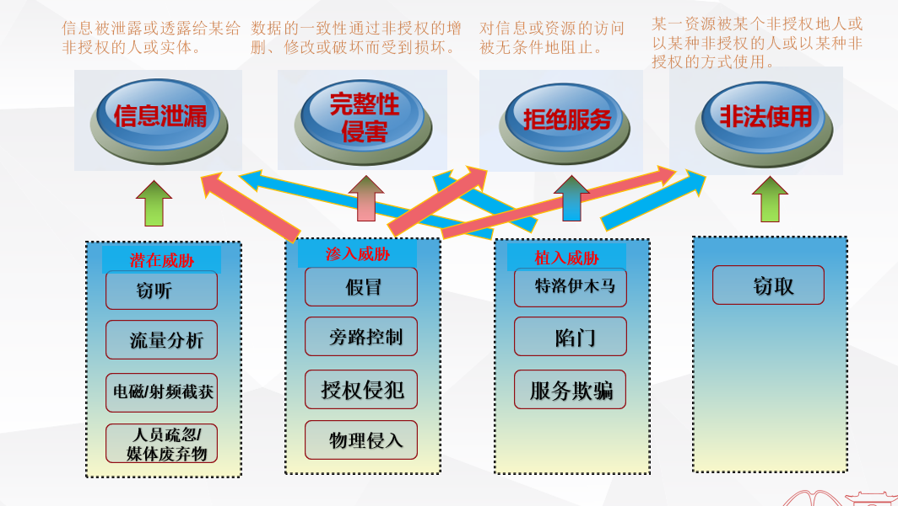
  
3. **安全防护措施**
   - 包括技术防护和管理措施，以防范外部入侵和内部人为因素的管理。

### 安全攻击的分类及常见形式
1. **安全攻击的种类**
   - 包括被动攻击和主动攻击。
   - 被动攻击：对所传输的信息进行窃听和监测；
   - 主动攻击：恶意篡改数据流或伪造数据流等攻击行为； 
   - 被动攻击虽然难以检测，但采取某些安全防护措施就可以有效阻止；而主动攻击虽然易于检测，但却难以阻止。
   - 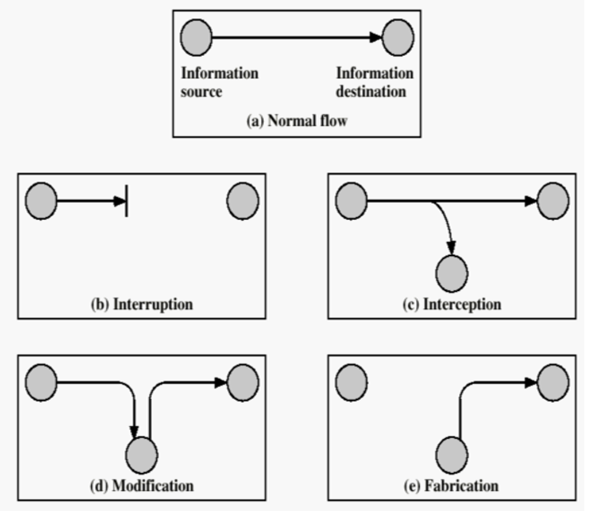
     - Interruption 中断 破坏可用性
     - Interception 截取 破坏机密性
     - Modification 修改 破坏完整性
     - Fabrication 伪造 破坏真实性

2. **攻击树**
   - 攻击树是一种**以分支模型直观地表示计算机安全威胁的方法(或威胁建模)**，用来确定哪些威胁最有可能，以及如何有效地阻止威胁。
   - 攻击的目标，如访问机密文件，是攻击树的根。
   - 每个分支代表实现该目标的不同方法，这些分支机构可能会从多个方向跳出，有各种不同的选择来实施这些方法

3. **攻击过程分析**
   - **预攻击(踩点和扫描)**
     - 目的：收集信息，进行进一步攻击决策
     - 内容：
       - 获得域名及IP分布
       - 获得拓扑及OS等
       - 获得端口和服务
       - 获得应用系统情况
       - 跟踪新漏洞发布
   - **攻击(入侵、获取权限、提升权限)**
     - 目的：进行攻击，获得系统的一定权限
     - 内容：
       - 获得远程权限
       - 进入远程系统
       - 提升本地权限
       - 进一步扩展权限
       - 进行实质性操作
   - **后攻击(清除日志、安插后门)**
     - 目的：消除痕迹，长期维持一定的权限
     - 内容：
       - 植入后门木马
       - 删除日志
       - 修补明显的漏洞
       - 进一步渗透扩展   

4. **安全攻击常见八种形式**
   - 包括口令窃取、欺骗攻击、缺陷和后门攻击、认证失效攻击、协议缺陷攻击、信息泄漏攻击、指数攻击、拒绝服务攻击等。

    1. **口令窃取**
       - **口令猜测攻击的三种基本方式：**
         - 利用已知或假定的口令尝试登录(口令字典、暴力破解、社会工程学字典攻击)；
         - 根据窃取的口令文件进行猜测；
         - 窃听某次合法终端之间的会话，并记录所使用的口令；
       - **抵御口令猜测攻击方式：**
         - 阻止选择低级口令，采用更为复杂的口令；
         - 对口令文件严格保护；
       - **彻底解决口令机制的弊端：**
         - 使用基于令牌的机制，例如一次性口令方案(OTP-One-Time Password)。
  
    2. **欺骗攻击**
       - 采用欺骗的方式(假冒、伪装等)获取合法信息并加以利用，获得权限：
         - Web欺骗(钓鱼邮件)；
         - IP欺骗；
         - DNS欺骗(域名劫持)；
         - ARP欺骗。

    3. **缺陷和后门攻击**
       - **缺陷：** 指程序中某些代码不能满足特定需求。
       - **后门：** 指能绕开正常的安全访问机制而直接访问程序的程序代码。
       - **缓冲器溢出(堆栈粉碎)攻击：** 程序对接受的输入数据没有进行有效检测导致的错误，可能造成程序崩溃或者是执行攻击者的命令。
         - 一种扰乱程序的攻击方法
         - 在堆栈上执行代码时出现程序指针紊乱      
       - **网络蠕虫攻击**：利用操作系统和应用程序**漏洞**传播，通过网络的通信功能将自身从一个结点发送到另一个结点并启动运行的程序，可以造成网络服务遭到拒绝并发生死锁。**蠕虫是一段独立的可执行程序，它可以通过计算机网络把自身的拷贝(复制品)传给其他的计算机。**
         - 方式之一是向守护程序发送新的代码
         - 蠕虫向“读”缓冲区内注入大量的数据

    4. **缓冲区溢出**
       - 这种攻击可以使一个匿名的Internet用户有机会获得一台主机的部分或全部的控制权。
       - 攻击者向一个有限空间的缓冲区中复制过长的字符串，可能造成程序瘫痪或系统崩溃，或让攻击者运行恶意代码，执行任意指令，甚至获得管理员用户的权限。

    5. **网络蠕虫攻击**
       - 网络蠕虫攻击是一种通过某种网络媒介，无须计算机使用者干预即可运行的独立程序，通过主动寻找目标计算机，不停的获得网络中存在漏洞的计算机上的部分或全部控制权来将代码副本进行传播。
       - 蠕虫攻击大量地消耗计算机时间和网络通信带宽，导致整个计算机系统及其网络的崩溃，成为拒绝服务攻击的工具。
       - 蠕虫会搜集、扩散、暴露系统敏感信息(如用户信息等)，并在系统中留下后门。这些都会导致未来的安全隐患。

    6. **认证失效攻击**
       - **认证机制的失效**易导致服务器被攻击者欺骗，此攻击会使系统对访问者所采取的**身份认证措施无效**。

    7. **协议缺陷攻击**
       - 协议本身的缺陷导致攻击的发生
         - TCP/IP协议、DNS和许多基于RPC的协议易遭到序列号攻击
         - IP协议易遭受地址欺骗攻击
         - HTTP协议、FTP协议等无安全考虑，易遭受攻击
         - 802.11无线数据通信标准中的WEP协议也存在缺陷
           - 通过改进协议设计消除此缺陷，如我国的WAPI标准

    8. **信息泄漏攻击**
       - 信息泄露的方式包括利用协议缺陷攻破系统、获得信息，软硬件故障导致意外泄密，病毒侵袭，以及内部信息安全管理不善所导致。
       - 信息泄露会使攻击者获得有价值的系统相关信息，并用之攻破系统

    9.  **指数攻击**
       - 指数攻击通常指的是攻击者利用系统或网络的某个特性，以极快的速度增长攻击力度，使得防御措施难以跟上攻击的变化。

    10. **拒绝服务攻击(DOS攻击)**
        - 拒绝服务攻击(DoS)指攻击者利用系统缺陷，通过执行一些恶意的操作而使得合法的系统用户不能及时地得到应得的服务或系统资源。
        - 分布式拒绝服务攻击(Distributed Denial of Service， DDoS)是一种基于DoS攻击、但形式特殊的拒绝服务攻击，采用一种分布、协作的大规模攻击方式。

    11. **SYN Flood(泛洪)攻击**
        - SYN Flood攻击是一种常见的DoS攻击，通过发送大量的SYN请求来消耗服务器的资源，导致服务器无法处理正常的请求。

    12. **Smurf 攻击**
        - Smurf攻击是一种拒绝服务攻击，攻击者发送大量的ICMP回显请求数据包到一个广播地址，使得网络上的所有主机都向被攻击的主机发送ICMP回显应答。

    13. **社会工程学攻击**
        - 社会工程学攻击是一种通过受害者心理弱点、本能反应、好奇心、信任、贪婪等心理陷阱进行欺骗、伤害等危害手段，取得自身利益的手法。
        - 社会工程学是非传统的信息安全
        - 常用的手段：环境渗透、引诱、伪装、恐吓、恭维、说服
        

### OSI模型与安全体系结构
1. **ISO 7498-2标准**
   - 确定了OSI开放系统互连参考模型的信息安全体系结构。
   - 充分体现信息安全层次性和结构性特点，是一个以防护为主的静态的安全体系结构。  

2. **OSI安全体系结构模型**
   - 包括安全服务、安全机制和安全攻击。
   - 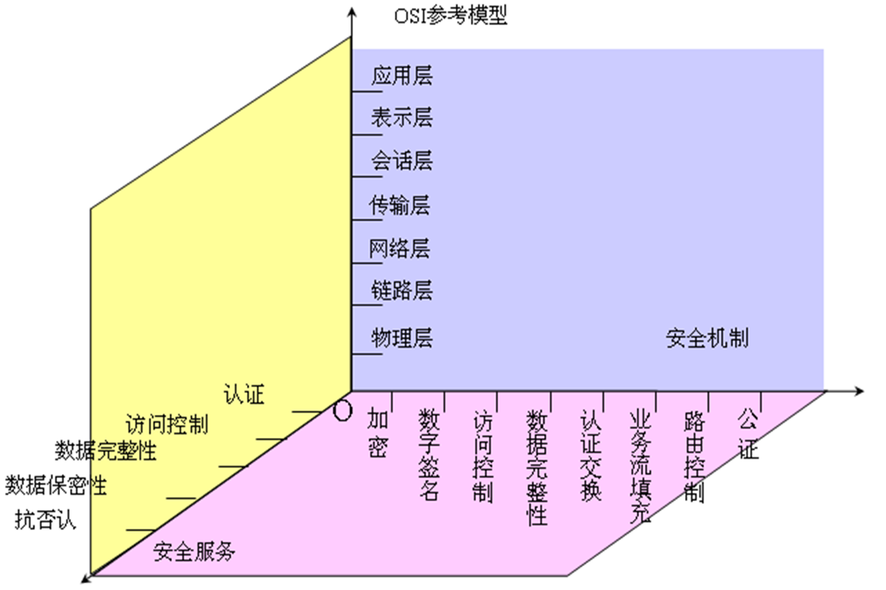

3. **安全服务**
   - 分为认证服务、访问控制服务、数据机密性服务、数据完整性服务和非否认服务。
   1. **认证服务**
      - **定义：** 提供关于某个实体(人或事物)身份的保证，证实实体声明的身份。
      - 认证服务是可控性服务的重要组成部分，通常使用在需要提交人或者事物的身份的这一类特殊的通信过程中。
      - **类型：**
        - **对等实体认证(Peer Entity Authentication)：** 确认通信过程中远端用户的身份。
        - **数据起源认证(Data Origin Authentication)：** 确认数据发送者的身份，保证数据的真正起源。

   2. **访问控制服务**
      - **定义：** 实施授权的一种方法，防止对资源的未授权使用。
      - **作用：**
        - 保护资源以防止非授权访问和操纵。
        - 保护敏感信息不经过有风险的环境传送。
        - 限制实体的访问权限，通常是经过认证的合法实体。

   3. **数据机密性服务**
      - **定义：** 保护信息不泄露或不暴露给未授权的实体。
      - **保密粒度：** 流(stream)、消息(message)、选择字段(field)
      - **内容：**
        - **数据的机密性服务：** 使用加密手段保护数据不被未授权者推断出敏感信息。
        - **业务流机密性服务：** 防止攻击者从分析网络业务流中得到敏感信息。

   4. **数据完整性服务**
      - **定义：** 确保数据的价值和存在性没有改变，对抗数据篡改攻击。
      - **内容：**
        - **单个数据单元或字段的完整性：** 保护数据单元不被非授权者修改。
        - **数据单元流或字段流的完整性：** 保护数据单元序列的完整性，防止数据单元的重放。

   5. **非否认服务(不可抵赖性)**
      - **定义：** 阻止参与某次通信交换的一方在事后否认曾经发生过本次交换的事实。
      - **类型：**
        - **起源的否认：** 向数据接收者提供数据源的证据，防止发送者否认发送过数据。
        - **传递的否认：** 向数据发送者提供数据已交付给接收者的证据，防止接收者否认收到数据。

4. **安全机制**
   - 安全服务与安全机制关系：
     - 安全服务体现了安全系统的功能；而安全机制则是安全服务的实现。
     - 一个安全服务可以由多个安全机制实现；而一个安全机制也可以用于实现多个安全服务中。
     - 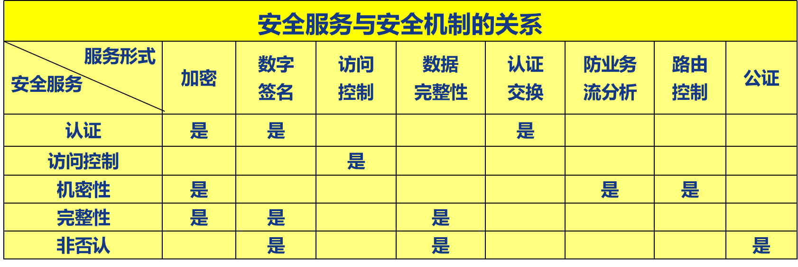

### 网络安全模型
1. **网络安全模型-网络通信**
   - 保护信息传输，需要提供**安全机制和安全服务**。
       - 一部分是对发送的信息进行与安全相关的转换。例如，消息的加密，使开放网络对加密的消息不可读；又如附加一些基于消息内容的码，用来验证发送者的身份。
       - 另一部分是由两个主体共享的秘密信息，而对开放网络是保密的。例如，用以加密转换的密钥，用于发送前的加密和接收前的解密。
   - 需要可信的第三方
   - 一种能被通信主体使用的协议，这种协议使用安全算法和秘密信息以便获得特定的安全服务。
   - 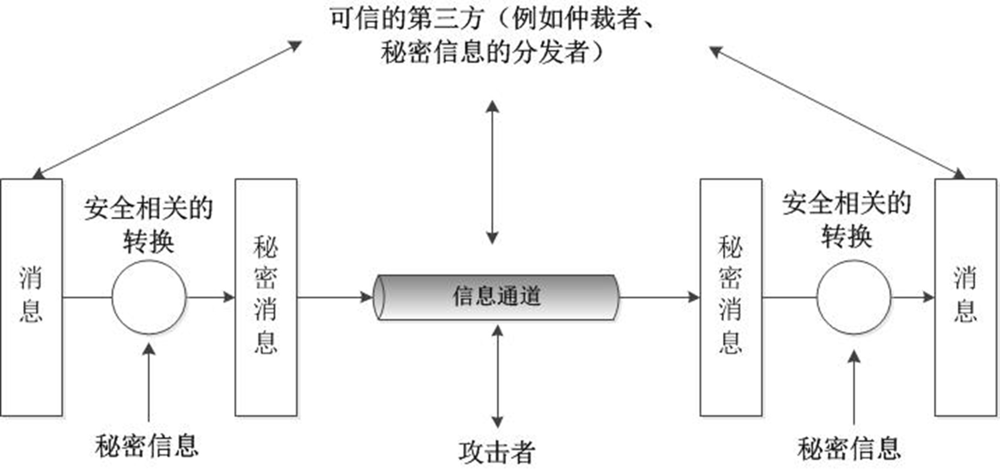

2. **网络安全模型-访问安全**
   - 考虑了黑客攻击、病毒与蠕虫等的非授权访问。
   - 黑客攻击可以形成两类威胁：一类是**信息访问威胁**，即非授权用户截获或修改数据；另一类是**服务威胁**，即服务缺陷以禁止合法用户使用。
   - 病毒和蠕虫是软件攻击的两个实例，这类攻击通常是通过移动存储介质引入系统，并隐藏在有用软件中；也可通过网络接入系统。
   - 两个层次：
     - **网闸或看门人功能**，阻止非授权用户访问
     - **内部安全控制(监控)**：监测有害入侵者的存在
   - 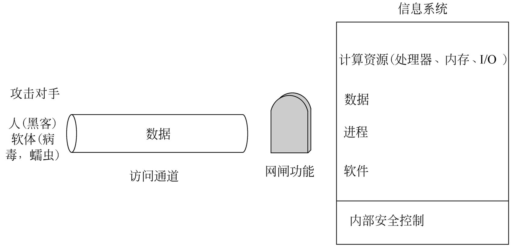

3. **网络安全模型- P2DR-时间模型**
   - P2DR模型是可量化的、可由数学证明的、基于时间的的安全模型， 
   - 包含安全策略(Policy)、防护(Protection)、检测(Detection)和响应(Response)。
     - 安全策略是P2DR安全模型的核心，所有的防护、检测、响应都是依据策略实施的；
     - 防护主要是预防安全事件的发生，发现存在的系统脆弱性和防止意外威胁和恶意威胁；
     - 检测是P2DR中一个非常重要的环节，是**静态防护转化为动态防护的关键**，动态响应和加强防护的依据，同时也是强制落实安全策略的工具；
     - 响应在安全系统中占有重要的地位，是解决安全潜在威胁最有效的方法。
   - 基本思想：信息安全相关的所有活动，无论是攻击、防护、检测和响应行为，都要消耗时间，因此可以用**时间尺度**来衡量一个体系的能力和安全性。
   - 理论：系统的检测时间与响应时间越长，或对系统的攻击时间越短，则系统的暴露时间越长，系统就越不安全；如果系统的暴露时间$E_t<=0$(即$D_t+R_t<=P_t$)，那么认为系统是安全的
   - 安全的目标：尽可能地增大保护时间，尽量地减少检测时间和响应时间。  

4. **网络安全模型- PDRR**
   - 包括防护(Protection)、检测(Detection)、响应(Response)、恢复(Recovery)
   - 这4个部分构成了一个**动态的信息安全周期**
   - 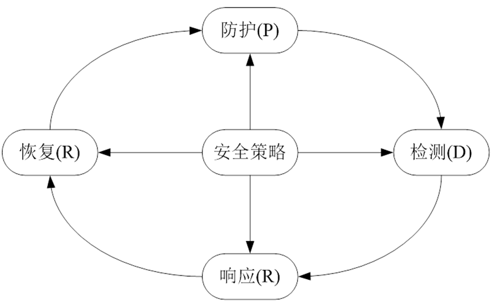

## 第二节 网络安全防护技术

### 防火墙
1. **防火墙概述**
   - **定义**：防火墙是在两个网络之间执行访问控制策略的一个或一组安全系统。由软件和硬件组成的系统集合，是实现网络安全策略的有效工具之一，位于安全的网络和不安全的网络之间，属于**边界防护设备**。
   - **功能**：
     - 通过设置访问控制规则，对进出网络边界的**数据流进行过滤**。
     - 防火墙是建立在内外网络边界上的**过滤封锁机制**，是一种用于保护本地系统或者网络不受基于网络的安全威胁的有效方法。
       - **内部网络**(受信网络)被认为是安全和可信赖的，而**外部网络**(通常是Internet，非受信网络)被认为是不安全和不可信赖的。
       - **非军事化区(DMZ)**：为了配置管理方便，内网中需要向外提供服务的服务器往往放在一个单独的网段，这个网段便是非军事化区。
   - 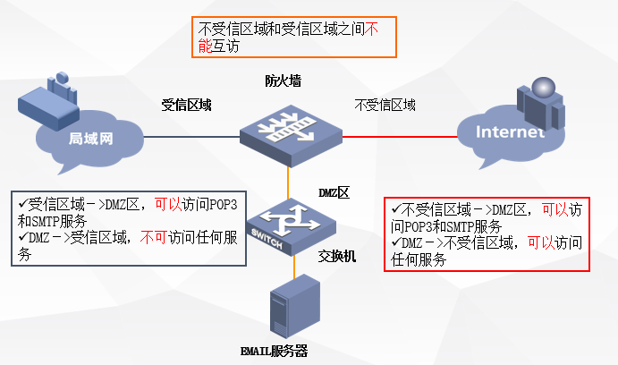

2. **防火墙的要求**
   - 所有进出网络数据流都必须经过防火墙。
   - 只允许经授权的数据流通过防火墙。
   - 防火墙自身对入侵免疫，即确保自身安全。

3. **防火墙提供的四种控制机制**
   - **服务控制**：确定了可访问的Internet服务类型，这种控制是双向的，如防火墙可以**以IP地址和TCP端口号为基础对流量进行过滤**；可以提供委托代理软件对收到的每一个服务请求进行解释之后才允许通过。
   - **方向控制**：确定特定的服务请求可以发起和通过的方向，即允许通过防火墙进入或离开。
   - **用户控制**：控制特定用户对某些服务的访问权限。
   - **行为控制**：控制特定服务的应用方式，如控制外部用户只能访问只能访问本地web服务器的部分信息。

4. **防火墙的发展**
   - 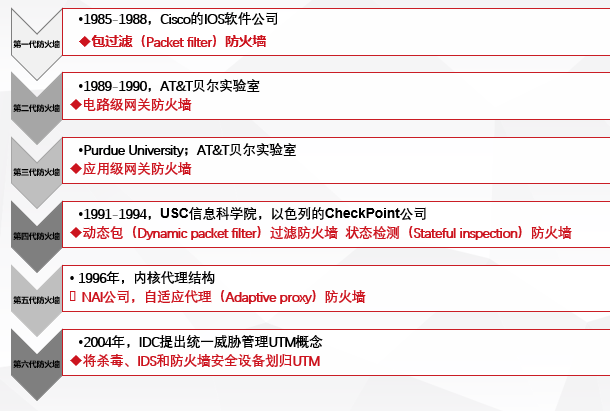

5. **防火墙分类及设计结构**
   - 防火墙分类
      - 
   - 防火墙设计结构
      - 

6.**OSI模型与防火墙类型的关系**
   - 防火墙工作于OSI模型的层次越高，能提供的安全保护等级就越高。
   - 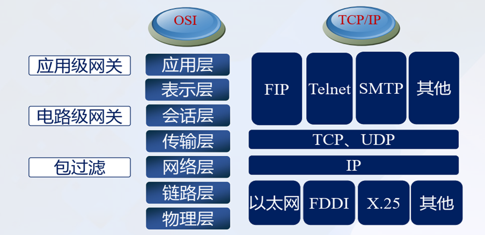
   - 防火墙通常建立在**TCP/IP模型**基础上，OSI模型与TCP/IP模型之间**并不存在一一对应**的关系
   - 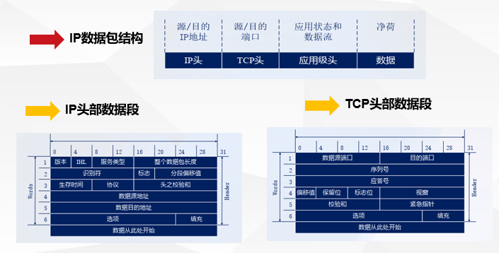

7. **防火墙能与不能**
   - 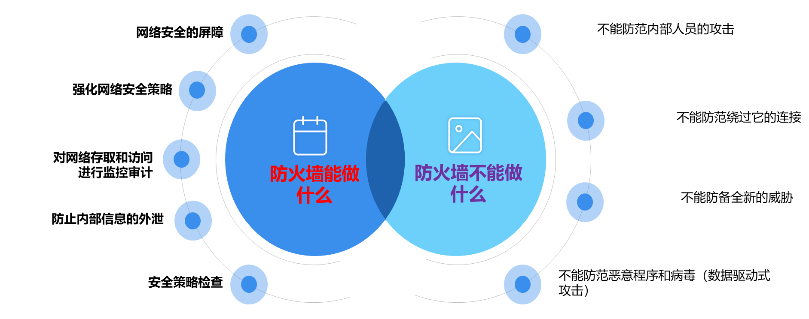
   
8. **防火墙原理**
   1. **静态包过滤防火墙**：
      - **包过滤(Packet Filtering)技术**是防火墙利用对数据包的分析能力，在**网络层**中根据数据包中包头信息有选择地实施允许通过或阻断。
      - 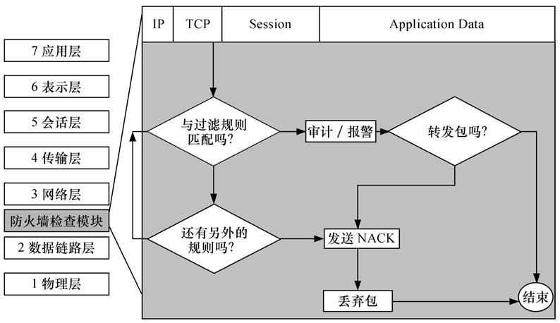
      - 作用过程：
        - 防火墙接收到从外部网络到达防火墙的数据包，对数据包过滤。
        - 对数据包施加过滤规则，对数据包IP头和传输字段内容进行检查。
        - 如果没有规则与数据包头信息匹配，则对数据包施加默认规则。
      - 判断依据(只考虑IP包)：
        - 数据包**封装协议类型**：TCP、UDP、ICMP、IGMP等
        - **源、目的IP地址**，数据包的TCP/UDP源、目的端口
        - **服务类型(端口)**：FTP(21)、HTTP(80)、DNS(53)等
        - IP选项：源路由、记录路由等
        - TCP选项：SYN、ACK、FIN、RST等
        - 其它协议选项：ICMP ECHO、ICMP ECHO REPLY等
        - **数据包流向**：in或out
        - **数据包流经网络接口**：eth0、eth1
        
   2. **动态包过滤防火墙**：
      - 与普通包过滤防火墙相似，大部分工作于**网络层**。有些安全性高的动态包过滤防火墙，则工作于**传输层**。
      - **动态包过滤防火墙的不同点**：
        - 对外出数据包进行**身份记录**，便于下次让具有相同连接的数据包通过。
        - 动态包过滤防火墙需要**对已建连接和规则表进行动态维护**，因此是动态的和有状态的。
      - 两种实现方式：
        - 实时地改变普通包过滤器的规则集
        - 采用类似电路级网关的方式转发数据包
   
   3. **电路级网关防火墙**：
      - 被称为线路级网关，工作在**会话层**，通常作为**应用代理服务器**的一部分，在应用代理类型的防火墙中实现，在**两个主机首次建立TCP连接时创立一个电子屏障**。
      - 电路级网关不**允许端到端TCP直接连接**，相反，电路级网关充当中介，**接收外来请求，转发请求**。
        - 监视两主机建立连接时的握手信息，如通过在TCP 3次握手建立连接的过程中，SYN、ACK等标志和序列号等是否合乎逻辑，判定该会话请求是否合法。
        - **一旦会话连接有效后网关在客户和服务器间中转数据**。
      - 电路级网关的防火墙的安全性比较高，但它仍**不能检查应用层的数据包**以消除应用层攻击的威胁。
      - 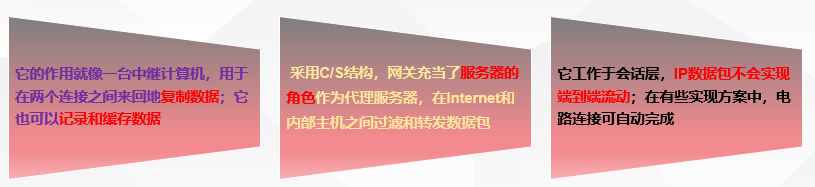
   
   4. **应用层网关防火墙**：
      - 代理对整个数据包进行检查，因此能在**应用层**上对数据包进行过滤。
      - 工作特点：
        - 必针对每个服务运行一个代理。
        - 对数据包进行逐个检查和过滤。
        - **采用“强应用代理”**
        - 在更高层上过滤信息自动创建必要的包过滤规则
        - 当前最安全的防火墙结构之一。
      - **应用代理与电路级网关两个重要区别**：
        - 代理是针对应用的。
        - 代理对整个数据包进行检查，因此能在OSI模型的应用层上对数据包进行过滤。
      
   5. **状态检测包过滤防火墙**：
      - 状态检测是一种相当于4.5层的过滤技术，建立状态连接表，并将进出网络的数据当成一个个的会话，利用状态表跟踪每一个会话状态。
      - 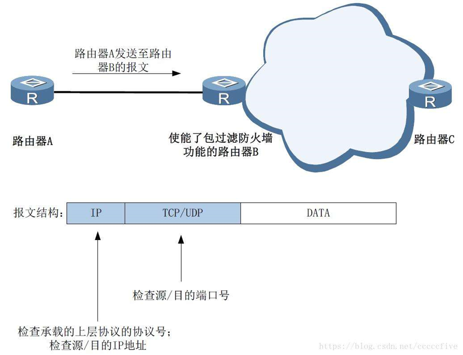
      - 优点：不限于包过滤防火墙的3/4层的过滤，又不需要应用层网关防火墙的5层过滤，既提供了比包过滤防火墙更高的安全性和更灵活的处理，也避免了应用层网关防火墙带来的速度降低的问题。
      - 作用过程：
        - 要实现状态检测，最重要的是**实现连接的跟踪功能，实现多个包的关联分析**。能够进一步分析主连接中的内容信息，识别出所协商的子连接的端口而在防火墙上将其动态打开，连接结束时自动关闭。
        - 通过**建立一个出站的TCP连接目录**加强了TCP数据流的监测规则，对网络通信的各层实施监测分析，提取相关的通信和状态信息，并在动态连接表中进行状态及上下文信息的存储和更新
      
   6. **空气隙防火墙**
      - 物理隔离，通过断开网络连接来保护内部网络不受外部网络的威胁。
      - 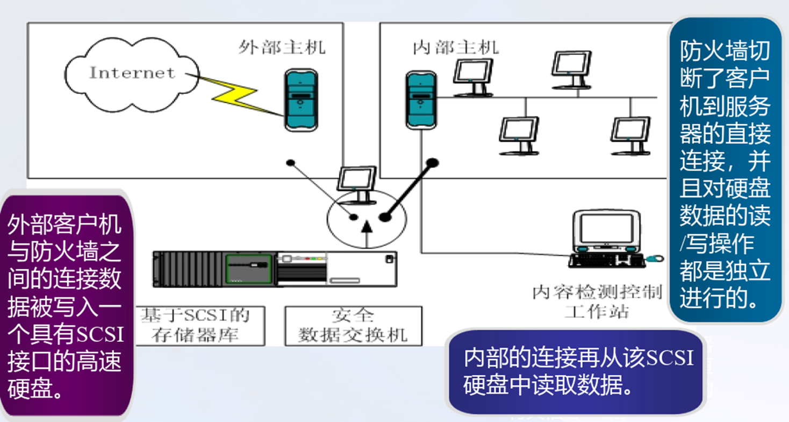

### 入侵检测系统

1. **入侵检测系统发展史**
   - 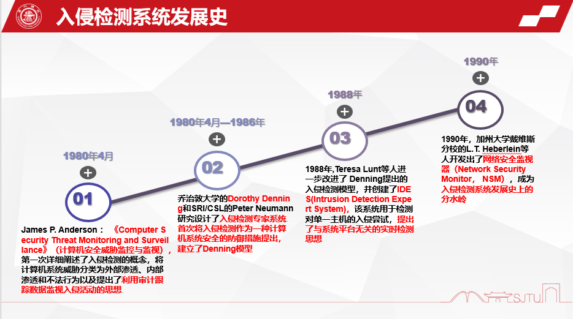

2. **通用的入侵检测系统模型**
   - 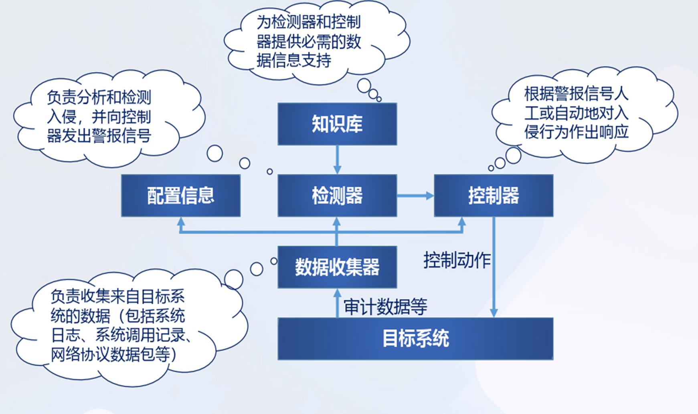

3. **功能任务**
   - **入侵检测系统定义**
     - 入侵检测系统（IDS）是一种对网络传输进行即时监视，在发现可疑传输时发出警报或者采取主动反应措施的网络安全设备。
   - **入侵检测定义**
     - 入侵检测(IDS : Intrusion Detection System)是通过从计算机网络或系统中的若干关键点**收集信息并对其进行分析**，从中发现网络或系统中是否有违反安全策略的行为和遭到袭击迹象的一种机制，基本上**不具有访问控制的能力**，单独使用不能起到保护网络的作用，也**不能独立地防止任何一种攻击**。
   - 功能任务
     - 信息收集：用户在网络、系统、数据库及应用系统中活动的状态和行为。
       - 系统和网络的日志文件
       - 目录和文件中的异常改变
       - 程序执行中的异常行为
       - 物理形式的入侵信息
     - 信息分析
       - 模式匹配
       - 统计分析
       - 完整性分析
     - 安全响应
       - 主动响应
       - 被动响应        
     
4. **系统结构**
   - 事件提取：负责提取相关运行数据或记录，并对数据进行简单过滤。
   - 入侵分析：找出入侵痕迹，发现异常行为，分析入侵行为并定位入侵者。
   - 入侵响应：分析出入侵行为后被触发，根据入侵行为产生响应。
   - 远程管理：在一台管理站上实现统一的管理监控。
   - 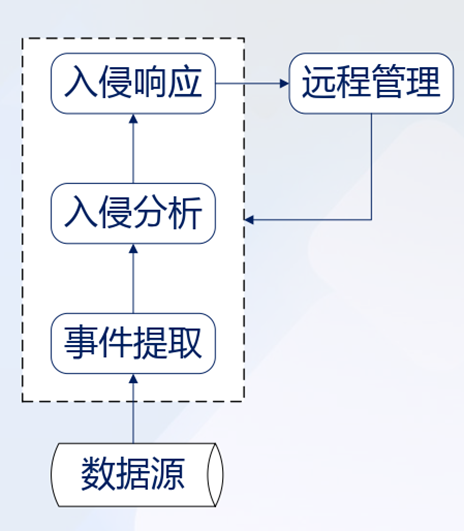

5. **分类**
   - **按照数据来源分类**
      1. *基于网络的IDS(NIDS)*：截获数据包，提取特征并与知识库中已知的攻击签名相比较。
         - 主要优点：
           - 拥有成本低。
           - 攻击者转移证据困难。
           - 实时检测和响应。
           - 能够检测未成功的攻击企图。
           - 操作系统独立。
         - 运作方式
           - 根据网络流量、网络数据包和协议来分析入侵检测。
           - 通常利用一个运行在随机模式下的网络适配器来监视并分析通过网络的所有通信业务。
         - 常用技术
           - 攻击模式、表达式或字节匹配。
           - 频率或穿越阈值。
           - 低级事件的相关性。
           - 统计学意义上的非常规现象检测。
         - 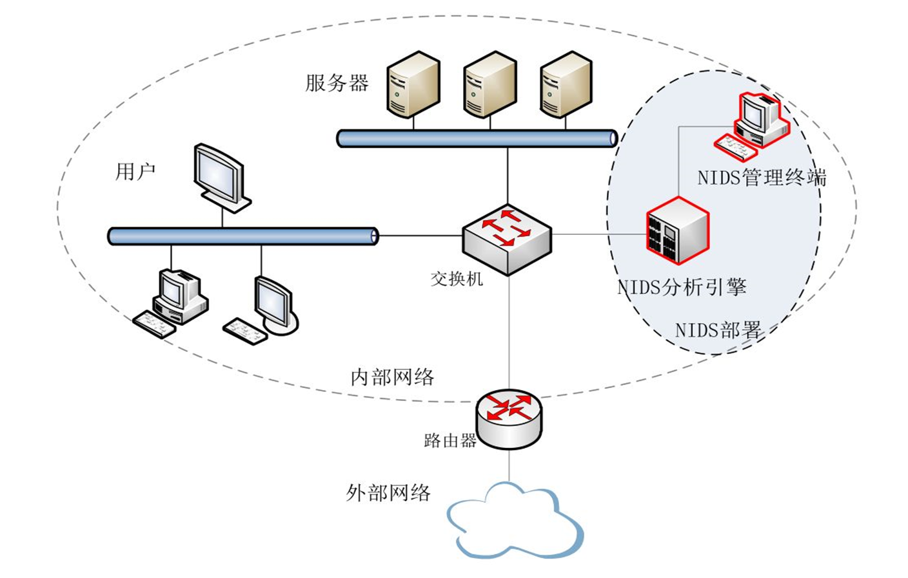
         
      2. *基于主机的IDS(HIDS)*：通过对日志和审计记录的监控分析来发现攻击后的误操作。
      3. *分布式IDS(DIDS)*：同时分析来自主机系统审计日志和网络数据流。
   - **按照检测策略分类**
      1. ***误用检测*：将收集的信息与数据库作比较**
        - 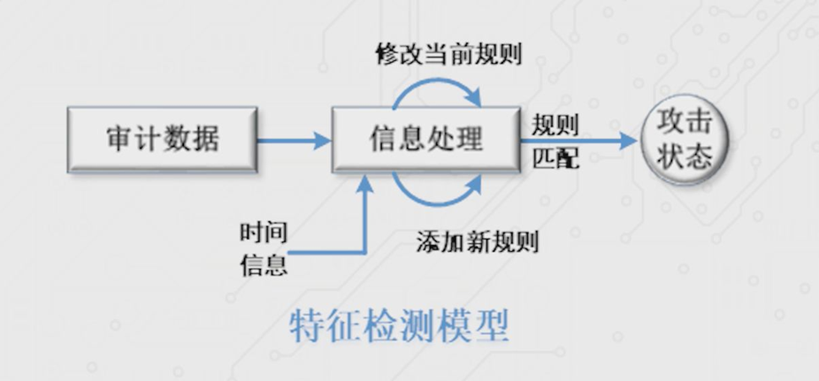
        - 原理：误用检测技术又称为**基于知识(或规则)的检测技术**或者**模式匹配检测技术**，收集非正常操作的行为特征，建立相关的特征库，当监测的用户或系统行为与库中的记录相匹配时，系统就认为这种行为是入侵 。
          - 假设所有的网络攻击行为和方法都具有一定的模式或特征。入侵模式说明了那些导致安全突破或其它误用的事件中的特征、条件、排列和关系。
        - 入侵检测方法：
          - 基于条件概率误用检测
          - 基于专家系统误用检测
          - 基于状态迁移误用检测
          - 基于键盘监控误用检测
          - 基于Petri网状态转换检测
      2. ***异常检测*：测量属性的平均值，并用来与系统行为比较**
        - 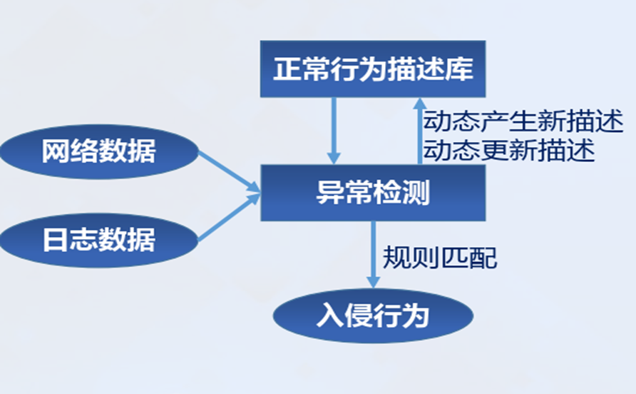
        - 原理：异常检测技术又称为**基于行为的入侵检测技术**，用来识别主机和网络中的**异常行为**。该技术假设攻击与正常合法的活动有明显的差异，首先假设网络攻击行为是不常见的或是异常的，区别于所有的正常行为。
          - **阈值检测**：异常检测技术先**定义一组系统正常活动的阈值**，如CPU利用率、内存利用率、文件校验和等，然后将系统运行时的数值与所定义的“正常”情况比较，得出是否有被攻击的迹象。
          - **用户轮廓(Profile)**: 通常定义为各种行为参数及其阀值的集合，用于描述正常行为范围。
        - 入侵检测方法：
          - 统计异常检测方法
          - 特征选择异常检测方法
          - 基于贝叶斯推理异常检测方法
          - 基于贝叶斯网络异常检测方法
          - 基于模式预测异常检测方法
      3. ***完整性分析*：关注是否被更改**

6. **网络诱骗系统**
   - 密罐技术(Honeypot)就是建立一个虚假的网络，诱惑黑客攻击这个虚假的网络，从而达到保护真正网络的目的。
     - 蜜罐系统是一个包含漏洞的诱骗系统，通过模拟一个或多个易攻击的主机，给攻击者提供一个容易攻击的目标
     - 观测黑客如何探测并最终入侵系统
     - 拖延攻击者对真正目标的攻击 
   - 分类：
     - 

### 虚拟专网VPN

1. **虚拟专网VPN概述**
   - **定义**：VPN(虚拟专网，Virtual Private Network)：将物理上分布在不同地点的网络通过公用网络连接而构成**逻辑上的虚拟子网**。
   - **原理**：VPN基于Internet/Intranet等公用开放的传输媒体，通过**加密和认证**等安全机制建立虚拟的数据传输通道，以保障在公共网上传输私有数据信息不被窃取、篡改，是目前广泛应用于电子商务、电子政务等应用安全保护的安全技术。
   - 三个基本安全功能
     - **加密数据**：以保证通过公网传输的信息即使被他人截获也不会泄露。 
     - **信息认证和身份认证**：保证信息的完整性、合法性，并能鉴别用户的身份。 
     - **访问控制**：不同的用户有不同的访问权限。

2. **VPN特点**
   - 费用低
   - 安全保障
   - 服务质量保证(QoS)
   - 可扩充性和灵活性
   - 可管理性

3. **VPN分类**
   - **远程访问VPN(Access VPN)，也称为VPDN(拨号VPN)**
   ：移动用户在任何地方、时间与公司总部、公司内联网的VPN设备建立起隧道或秘密信道，实现访问连接。
   - **网关-网关VPN**：
     - 组建内联网(Intranet VPN，企业内部虚拟专网)
       - 在公司远程分支机构的LAN和公司总部LAN之间的VPN
     - 组建外联网(Extranet VPN，扩展的企业内部虚拟专网)。
       - 在供应商、商业合作伙伴的LAN和公司的LAN之间的VPN
   - 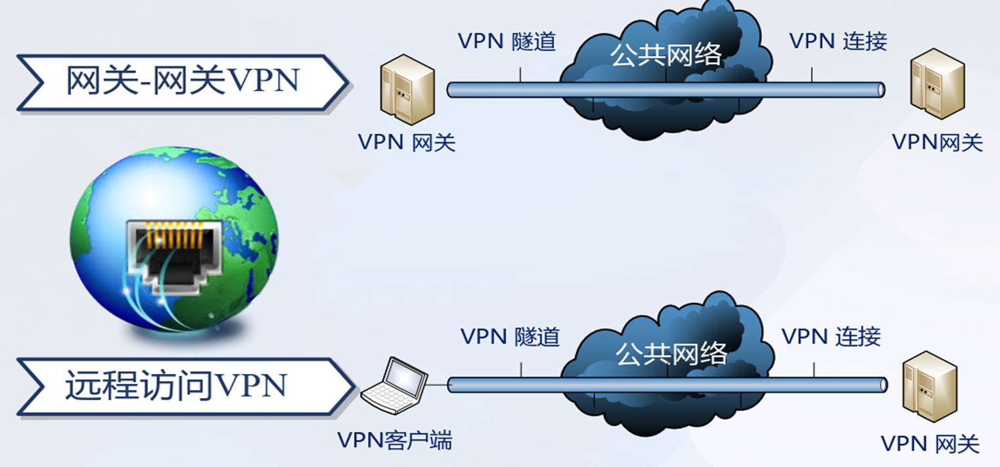
     

4. **VPN关键技术**
   - 隧道技术
   - 加/解密技术
   - 密钥管理技术
   - 身份认证技术
   - 访问控制技术

5. **IPSEC协议**
   1. **概述**
      - **定义**：IPSec是一种由IETF设计的端到端的**确保IP层通信安全**的机制，为保证在Internet上传送数据的安全保密性能的**三层隧道加密协议**，弥补IPv4设计时缺乏安全性考虑的不足，将安全服务集成到IP协议中(**加强IP协议的安全**)。
      - **IPSec对IPV4是可选的，对IPV6是必须的**
      - **地位**：IPSec定义了一种标准的、健壮的以及包容广泛的机制，为IP以及上层协议（比如TCP或者UDP）提供安全保证。      
      - IPSec由三种机制共同保障:
        - 认证
        - 数据机密性
        - 密钥管理
      - IPSec实现两个基本目标：
        - 保护IP数据包安全
        - 为抵御网络攻击提供防护措施。
      - IpSec提供服务：
        - 机密性（加密）
        - 数据完整性（接收方可以检验通过 Internet 传输的数据是否没有以任何方式更改或篡改过）
        - 身份验证（检验数据来源的身份）
        - 反重播保护（能够检测并拒绝重播的数据包以防止被欺骗）
  
   2. **体系结构**
      - IPSec由两大部分，三类协议构成：
        - AH(Authentication Header，认证头)
           - AH提供认证和数据完整性
        - ESP(Encapsulating Security Payload，封装安全载荷)
           - ESP具有所有AH的功能，还可以利用加密技术实现通信保密
        - IKE(Internet Key Exchange，密钥协商及交换协议)构成。
           - IKE定义了通信实体间进行身份认证、创建安全关联SA、协商加密算法以及生成共享会话密钥的方法。
      - 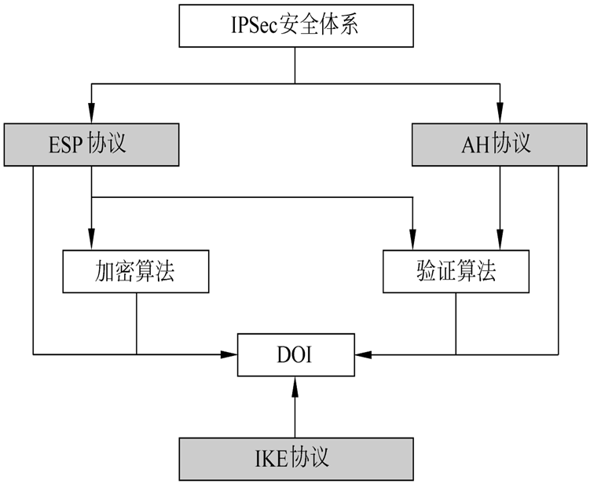
      - 两种操作模式：
        - 传输模式(主机与主机的直接通信)
        - 隧道模式(常用于关联到多台主机的网络访问连入设备间使用)
      - **安全关联SA**(Security Association)：是通信对等方对某些要素的一种协定
      - **两个重要数据库**：安全策略数据库SPD，安全关联数据库SAD
      
   3. **工作模式**
      - **传输模式**：
        - 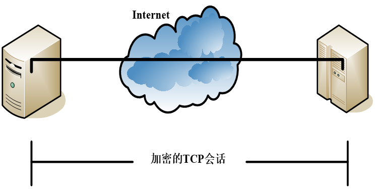
        - 保护的是**IP载荷**，通常应用于**两台主机之间，保护传输层协议头，实现端到端通信的安全性**，该模式要求主机支持IPSec。
        - 当数据包从传输层传送给网络层时，AH和ESP会进行拦截，在IP头与上层协议之间需插入一个IPSec头。当同时应用AH和ESP到传输模式时，应该先应用ESP，再应用AH。
        - 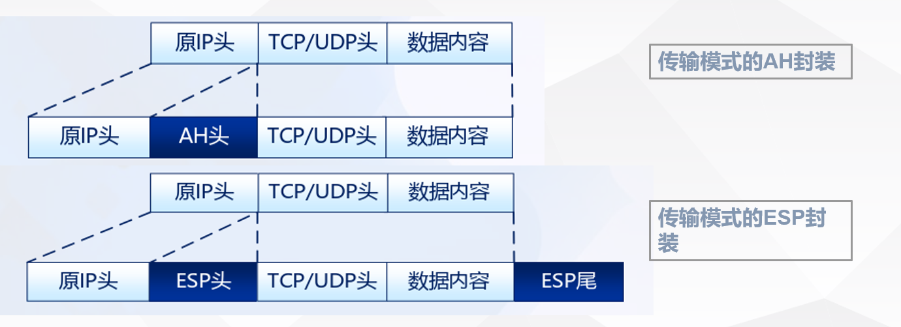
          - 采用传输模式时，IPSec只对IP数据包的净荷进行加密或认证；
          - 封装数据包继续使用原IP头部，只对部分域进行修改；
          - IPSec协议头部插入到原IP头部和传送层头部之间。
          
      - **隧道模式**：
        - 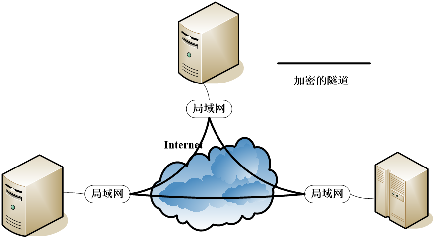
        - 保护的是**整个IP包**，应用于**网关模式中**，即在主机与网关(防火墙、路由器)或两个网关之间加载IPSec。
        - 把一个包封装在另一个新包里面，整个源数据包作为新包的载荷部分，并在前面添加一个新的IP对。被封装的数据包在隧道的两个端点之间通过公共互联网络进行路由。
        - 被封装的数据包在公共互联网络上传递时所经过的逻辑路径称为**隧道**。一旦到达网络终点，数据将被解包并转发到最终目的地。
        - 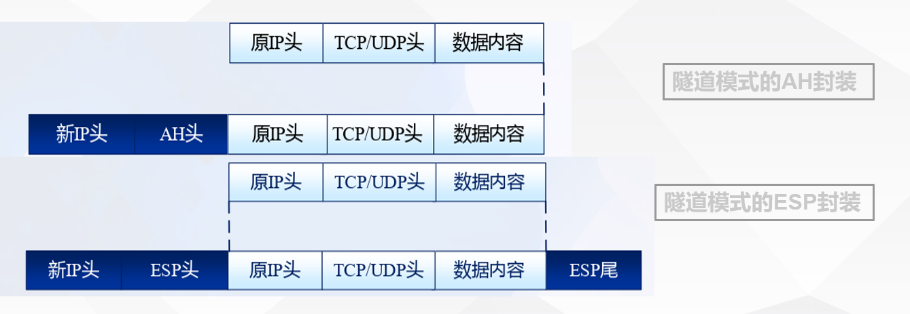
          - 采用隧道模式时，IPSec对整个IP数据包进行加密或认证；
          - 产生一个新的IP头，IPSec头被放在新IP头和原IP数据包之间，组成一新IP头。
      - 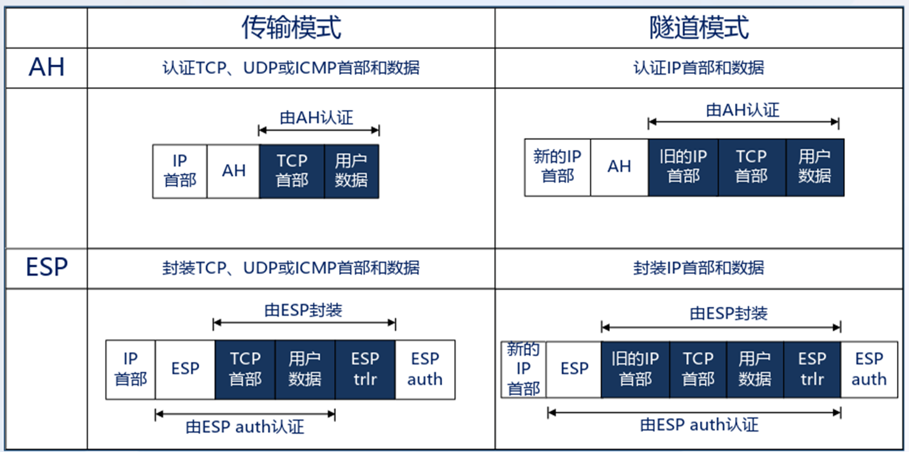

6. **TLS协议概述**
   - **定义**： SSL VPN也称做传输层安全协议(TLS)VPN。
   - TLS:基于会话的**加密和认证**的Internet协议，为通信的两个实体提供了一个安全的通道。
   - TLS协议主要用于HTTPS协议中，TLS也可以作为构造VPN的技术。
   - TLS VPN最大优点是用户不需要安装和配置客户端软件。
   - 由于TLS协议允许使用**数字签名和证书**，所以它可以提供强大的认证功能。
      
### 计算机病毒防护技术

1. **计算机病毒特征**
   - **传染性**：计算机病毒会通过各种渠道扩散到更多的计算机系统上。
   - **隐蔽性**：病毒通常会采用隐藏进程、文件等手段延长自己的生命周期，隐藏自己的行迹，以防被发现、被删除。
   - **寄生性**：病毒通常附着在其它正常程序之中，当调用程序时窃取到系统的控制权，先于正常程序执行。**现在这个特性正在变化**
   - **潜伏性**：大部分病毒感染系统之后不会马上发作，可长期隐藏在系统中，只有在满足其特定条件时才启动其表现（破坏）模块。
   - **破坏性**：侵入系统后会对系统及应用程序产生不同程度的影响，如降低计算机工作效率，占用系统资源，导致系统崩溃。

2. **计算机病毒传播方式**
   - 通过共享目录攻击
   - 通过漏洞攻击
   - 通过WEB方式攻击
   - 通过FIP方式攻击
   - 通过邮件攻击
   - 通过光盘读写攻击
   - 通过软盘读写攻击

3. **计算机反病毒技术与发展历史**
   - 反病毒的核心思想：在病毒的存储、传播和执行等阶段，基于“发现”、“拦截”、“清除”等基本手段来对抗病毒
   - 反病毒技术和形式经历了三个主要阶段：
     - 基于**简单特征码**查杀的单一专杀工具阶段
     - 基于**广谱特征码**查杀、主动防御拦截的综合杀毒软件阶段
     - 基于**云、人工智能和大数据**技术的互联网查杀阶段。

4. **计算机病毒分类**
   - 木马型病毒
   - 感染性病毒
   - 蠕虫型病毒
   - 后门型病毒
   - 恶意软件

5. **计算机病毒主流检测技术**
   - 病毒检测原理
     - **采样、匹配、基准**
   - 主流检测技术
     - 基于特征码的传统检测技术
       - 采样为固定位置、采用精准匹配方式技术简单、易于实现、查杀精准速度慢、无法查杀未知病毒
     - 基于行为的传统检测技术
       - 针对病毒动态行为进行检测，针对隐蔽性强的病毒有更好检测能力，具备查杀未知病毒能力
     - 基于云技术的云查杀技术
       - 将“匹配”和“基准”放在云端进行，反应速度快，终端资源使用大大减小  
     - 基于大数据与人工智能的查杀技术  
       - 将“匹配”和“基准”放在云端进行，可以根据模型匹配已知与未知病毒
        

### 安全漏洞扫描技术

1. **漏洞概述**
   - **定义**：漏洞(Vulnerability)又叫脆弱性，是信息技术、信息产品、信息系统在设计、实现、配置、**运行等过程中有意或无意产生的缺陷**，一旦被恶意主体所利用，就会造成对信息系统的安全损害，从而影响构建于信息系统之上正常服务的运行，危害信息系统及信息的安全属性。
   - **特点**：
     - 漏洞是信息系统**自身的弱点和缺陷**；
     - 漏洞**存在于一定的环境中**，寄生在一定的客体上；
     - 具有**可利用性和违规性；本身的存在虽不会造成破坏，但是可以被攻击者利用**，从而给信息系统安全带来威胁和损失

2. **漏洞扫描技术概述**
   - 漏洞扫描即针对通用漏洞的检测，需要依据通用漏洞的形成原理和其造成的外部表现来判断。由系统维护人员识别安全风险，依据结果对漏洞实施有针对性的防护或修补。
   - 漏洞按照被公布时间的不同阶段，可分为
     - 1 Day 漏洞
       - 发现并公布的最新漏洞
     - N Day 漏洞
       - 被公布的历史漏洞
     - 0 Day 漏洞
       - 未被公开的漏洞
   - 各类漏洞管理标准
     - 国外：MITRE CVE、CWE、NIST NVD、Symantec BUGTRAQ等
     - 国内：中国信息安全测评中心维护的CNNVD国家信息安全漏洞库，国家互联网应急中心CNCERT维护的CNCVE、CNVD国家信息安全漏洞共享平台等    

3. **漏洞扫描技术分类**
   1. 按照漏洞扫描的目标对象类型维度划分
     - **系统扫描**：扫描目标是已规模化发布的系统、应用软件或者设备。
       - 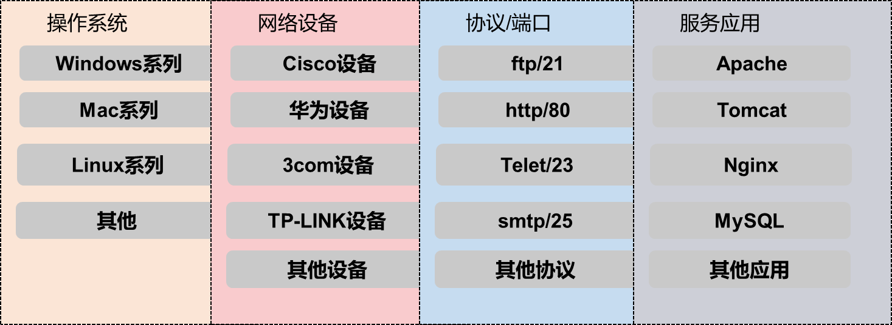
     - **应用扫描**：扫描目标是各种应用，以Web应用居多。
       - 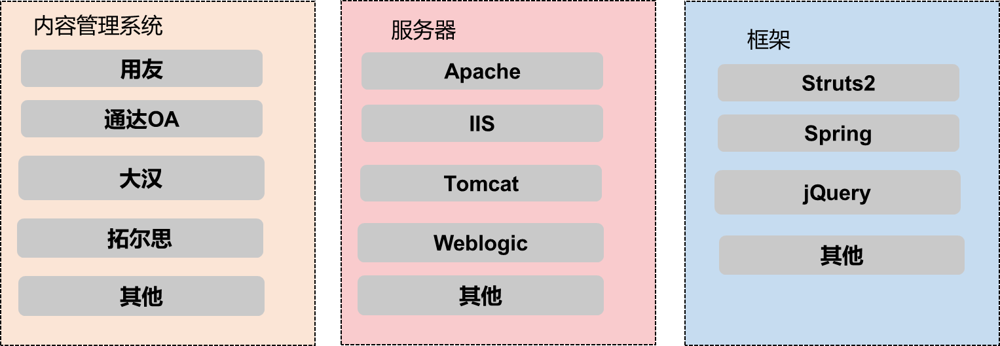
     - 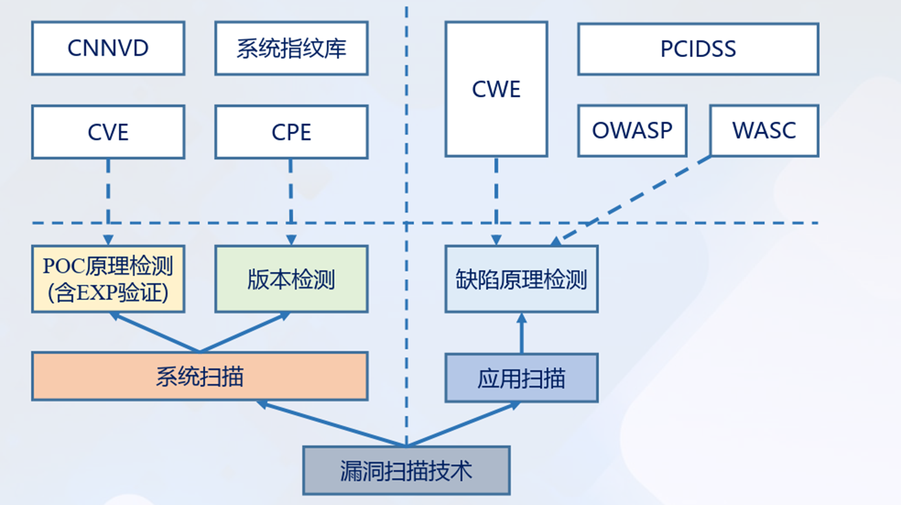
   2. 按照漏洞扫描的技术执行形式的维度划分
     - 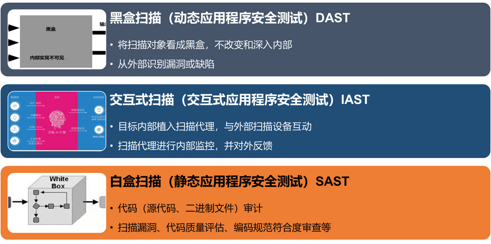

4. **漏洞扫描原理简介**
   - 漏洞扫描基本流程原理
     - 存活判断：探测目标系统是否存活。
     - 端口扫描：对已经存活的主机，探测主机上开启了哪些端口。
     - 系统和服务识别：采用黑盒测试方法，通过研究其对各种探测的响应形成识别指纹，进而识别目标主机运行的操作系统。
     - 漏洞检测：扫描器根据识别的系统与服务信息调用内置或用户外挂的口令字典进行口令猜测，并同时启动远程非登陆漏洞扫描。
   - 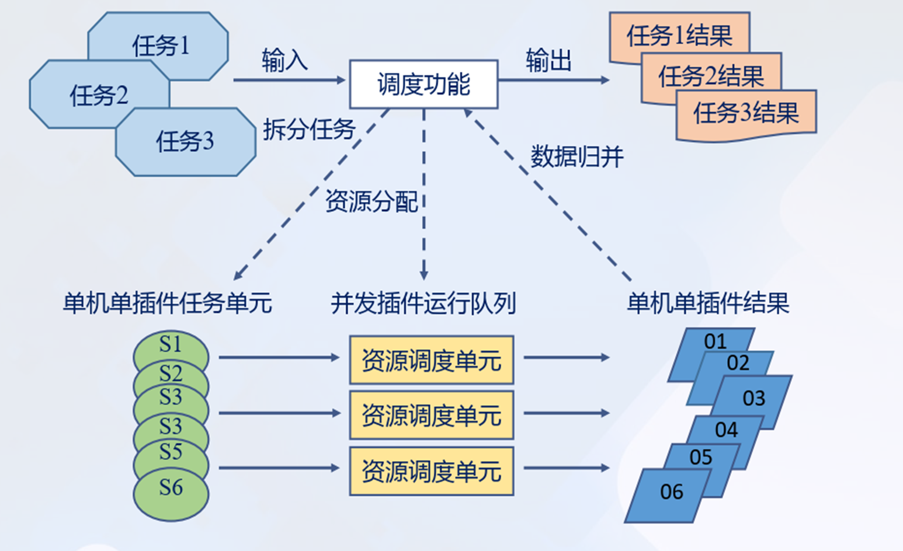
   - 原理检测和版本检测
     - 原理检测(POC检测)：对目标机的相关端口发送请求构造的特殊数据包，判断漏洞是否存在。
       - POC全称“proof of concept”，中文意思是漏洞概念验证。
       - 通常由一段漏洞验证代码或者漏洞检测数据。通过对检测目标发送此代码或数据后，通过被检测目标返回的信息特殊性，判断漏洞的实际存在与否。
     - 版本检测：依照漏洞库标准实施，在漏洞与系统版本之间存在关联关系。

## 第三节 网络安全工程与管理

### 网络安全等级保护

1. **网络安全等级保护制度**
   - 《网络安全法》第二十一条规定，国家实行网络安全等级保护制度，核心是对网络实施等级保护和分等级监督。
   - 网络分为**五个安全保护等级**，根据网络在国家安全、经济建设、社会生活中的重要程度，以及其一旦遭到破坏、丧失功能或者数据被篡改、泄露、丢失、损毁后，对国家安全、社会秩序、公共利益以及相关公民、法人和其他组织的合法权益的危害程度等因素。

2. **网络安全等级保护相关政策**
   - 信息安全等级保护是党中央国务院决定在信息系统安全领域实施的基本国策。
   - 信息安全等级保护是国家信息安全保障工作的基本制度。
   - 信息安全等级保护是国家信息安全保障工作的基本方法。
   - 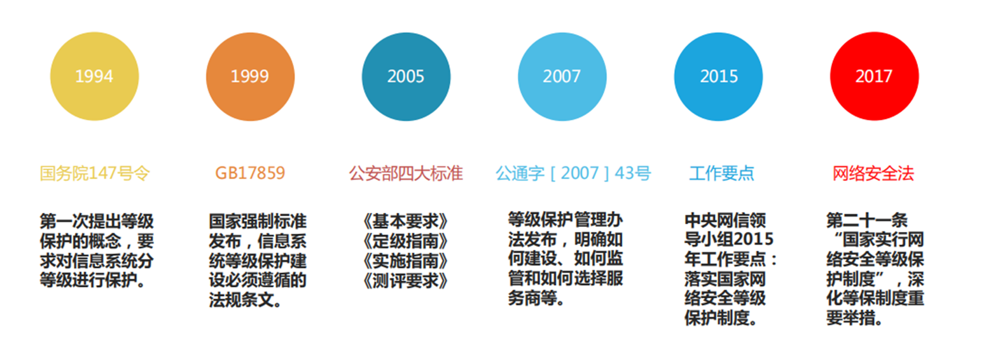

3. **安全等级划分**
   - 第一级 用户自主保护级
     - 一旦受到破坏会对相关公民、法人和其他组织的合法权益造成损害，但不危害国家安全、社会秩序和公共利益的一般网络
   - 第二级 系统审计保护级
     - 一旦受到破坏会对相关公民、法人和其他组织的合法权益造成严重损害，或者对社会秩序和公共利益造成危害，但不危害国家安全的一般网络
   - 第三级 安全标记保护级
     - 一旦受到破坏会对相关公民、法人和其他组织的合法权益造成特别严重损害，或者会对社会秩序和社会公共利益造成严重危害，或者对国家安全造成危害的重要网络
   - 第四级 结构化保护级
     - 一旦受到破坏会对社会秩序和公共利益造成特别严重危害，或者对国家安全造成严重危害的特别重要网络
   - 第五级 访问验证保护级
     - 一旦受到破坏后会对国家安全造成特别严重危害的极其重要网络

4. **安全等级设计要素**
   - 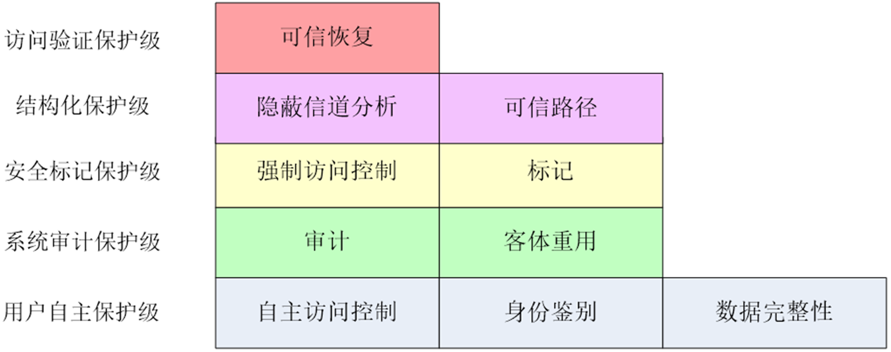

5. **等级保护工作流程**
   - 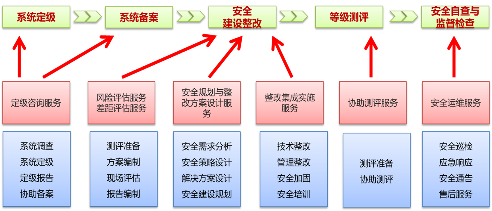
   - 安全定级流程
     - 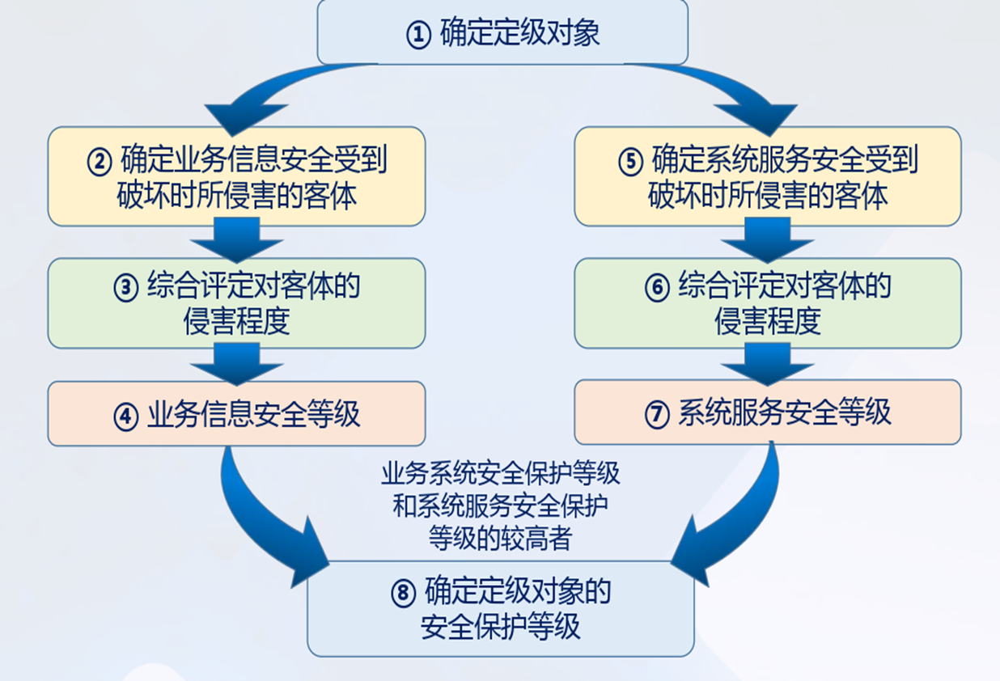
     - 业务信息安全保护等级
     - 
     - 系统服务安全保护等级
     - 

6. **等级保护2.0标准体系**
   - 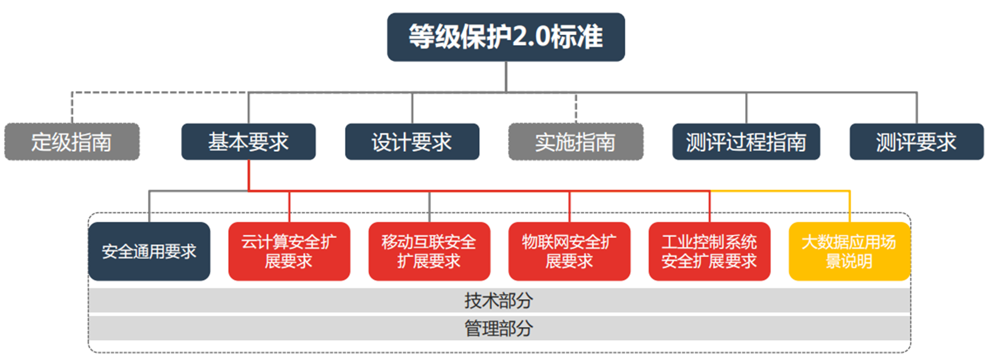

7. **等级保护安全设计技术框架**
   - 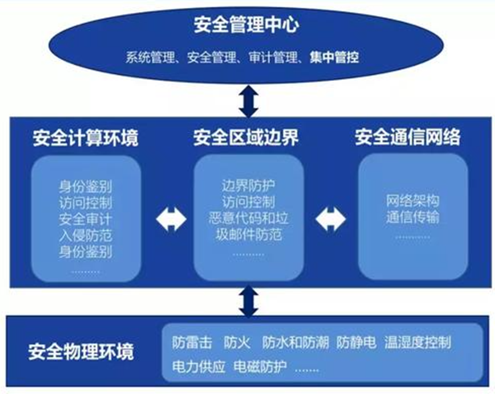

### 网络安全管理

1. **网络安全管理**
   - 定义：网络安全管理是网络安全工作中的重要概念，包括技术控制措施和管理控制措施。
   - 网络安全管理是指**把分散的网络安全技术因素和人的因素，通过策略、规则协调整合为一体，服务于网络安全的目标。**
   - 任务和目标：信息安全管理是以管理对象的安全为任务和目标的管理。
     - 任务：保证管理对象的安全。
     - 目标：达到管理对象所需的安全级别，将风险控制在可以接受的程度。
   
2. **网络安全管理体系（ISMS）**
   - **定义**：
     - 信息安全管理体系（Information Security Management Systems, 简称ISMS）是组织整体管理体系的一个部分，是基于风险评估建立、实施、运行、监视、评审、保持和持续改进信息安全等一系列的管理活动。
        1. 基于**风险管理思想**，建立一个系统化、程序化和文件化的管理体系。
        2. 强调全过程和动态控制。
        3. **控制费用与风险平衡的原则**，保护关键信息资产，使得网络安全风险的发生概率和结果降低到可接受的水平。
   
   - 国外网络安全管理相关标准
     - 目前，ISO/IEC 2700X标准系列是国际主流，国家标准化组织（ISO）专门为ISMS预留了一批标准序号。该系列的**两个核心、基础标准ISO/IEC 27001和ISO/IEC 27002**已于2005年10月正式发布第一版，2013年10月正式发布第二版。
   - 我国网络安全管理相关标准
     - 我国早期主要采用与国际标准靠拢的方式，近年来加强网络安全管理标准的自主制定，已经开始向国际标准化组织提交国际标准提案。在全国信息安全标准化技术委员会内，第7工作组(WG7)的努力下，我国已经正式发布一系列网络安全管理标准。
   - 网络安全管理控制措施
     - 为了对组织所面临的的安全风险实施有效的控制，应针对具体地安全威胁和脆弱性，采取适当的控制措施。ISO/IEC 27002标准提出了**14个方面的管理控制措施**，包括网络安全策略、网络安全组织、人力资源安全、资产管理、访问控制、密码、物理和环境安全、运行安全、通信安全、系统获取、开发和维护、供应商关系、网络安全事件管理、业务连续性管理和网络安全方面、符合性
   - ISO 27000系列
     - 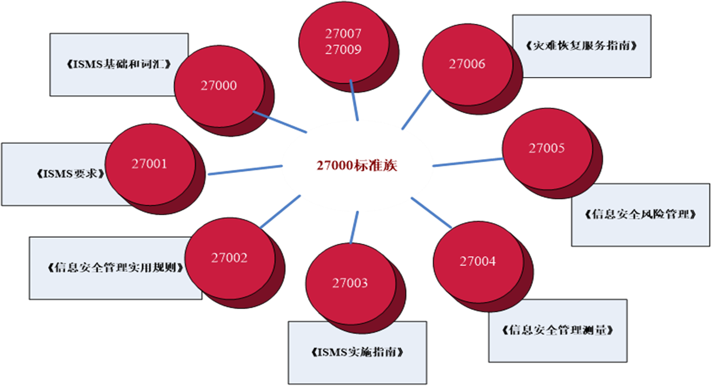

3. **网络安全风险管理**
   - 定义：一种**在风险评估的基础上对风险进行处理的工程**。网络安全风险管理实质是基于风险的网络安全管理。
   - 信息安全风险评估
   - 信息系统安全评估

4. **风险评估**：
  - 定义：对信息资产面临的威胁、存在的弱点、造成的影响，以及三者综合作用而带来的风险的可能性的评估。**信息安全风险评估是建立信息安全保障机制中的一种科学方法。**
  - 信息安全风险：
    - 人为或自然的威胁利用系统存在的脆弱性引发的安全事件，并由于受损信息资产的重要性而对机构造成的影响。
  - 信息安全风险评估涉及4个主要因素：
    - **资产、威胁、脆弱性和风险**
  - 基本过程：
    - 风险评估准备过程
    - 资产识别过程、威胁识别过程、脆弱性识别过程
    - 风险分析过程
  - 主要任务：
    - 识别组织面临的各种风险 
    - 评估风险概率和可能带来的负面影响 
    - 确定组织承受风险的能力 
    - 确定风险消减和控制的优先等级 
    - 推荐风险消减对策
  - 关键问题：
    - 首先要确定保护的对象（或者资产）是什么？它的直接和间接价值如何？
    - 其次，资产面临哪些潜在威胁？导致威胁的问题所在？威胁发生的可能性有多大？ 
    - 资产中存在哪里弱点可能会被威胁所利用？利用的容易程度又如何？
    - 一旦威胁事件发生，组织会遭受怎样的损失或者面临怎样的负面影响？
    - 最后，组织应该采取怎样的安全措施才能将风险带来的损失降低到最低程度？ 
    
  
5. **信息系统安全评估**：
  - 或称为或简称为系统评估，是在具体的操作环境与任务下对一个系统的安全保护能力进行的评估。具体是指依据国家风险评估有关管理要求和技术标准，对信息系统及由其存储、处理和传输的信息的机密性、完整性和可用性等安全属性进行科学、公正的综合评价的过程。

6. **资产的有效保护**
   - 资产一旦受到威胁和破坏带来两类损失：
     - **即时的损失**，如由于系统被破坏，员工无法使用，因而降低了劳动生产率。
     - **长期的恢复所需花费**，也就是从攻击或失效到恢复正常需要的花费。
   - 为了有效保护资产，应尽可能**降低资产受危害的潜在代价**。由于采取一些安全措施，也要付出安全的操作代价。网络安全最终是一个**折中的方案**，需要对危害和降低危害的代价进行权衡。
   - 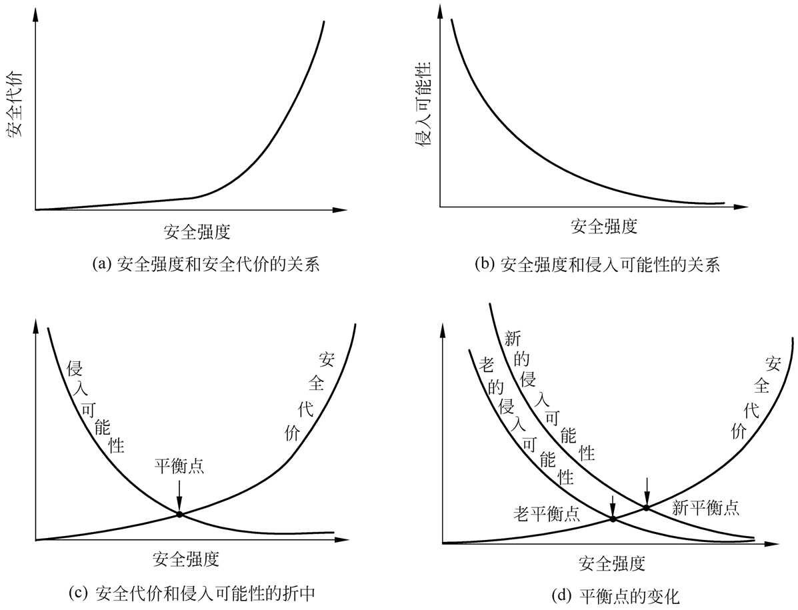

7. **风险管理实施流程**
   - 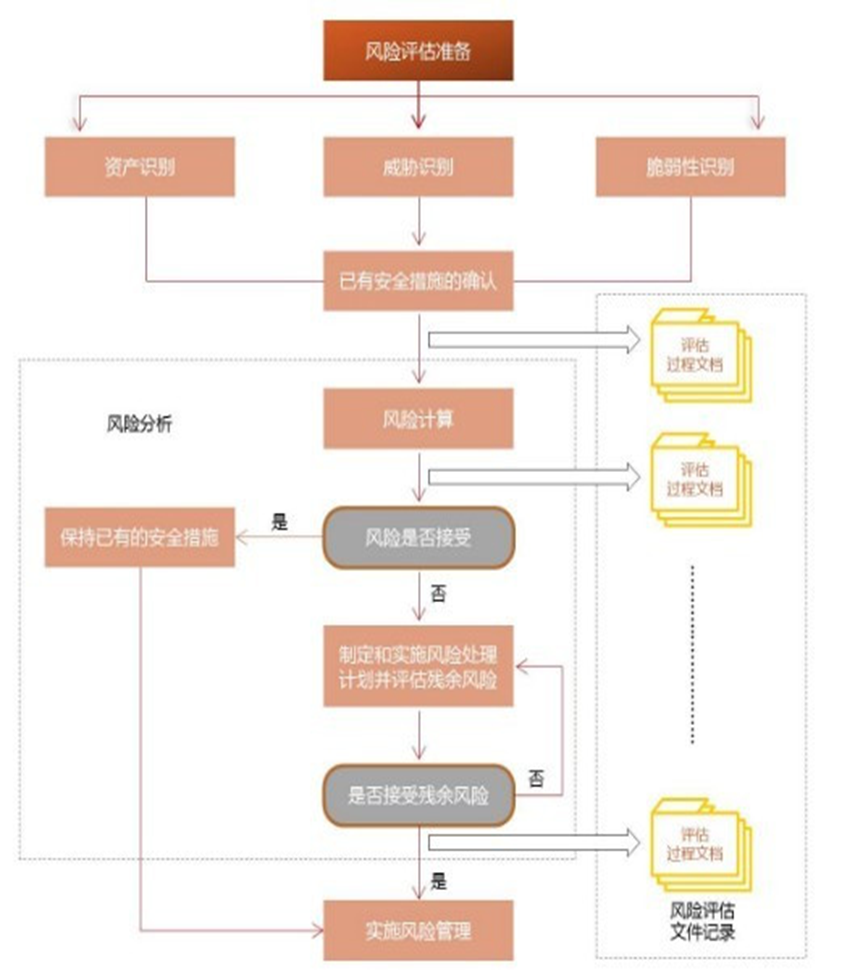
   - 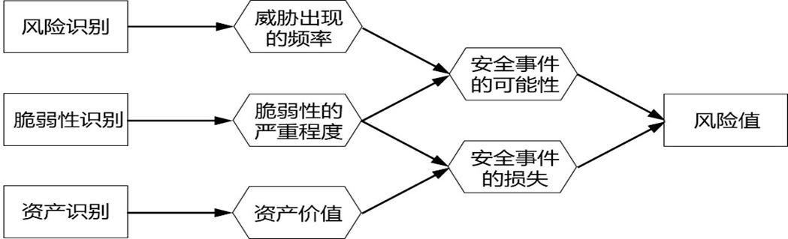
   - 风险管理的核心部分：**风险分析**
     - 资产属性：资产价值
     - 威胁属性：威胁主体、影响对象、出现频率、动机
     - 脆弱性属性：资产弱点的严重程度
   - 风险识别：
     - 漏洞
     - 威胁
     - 已有的对策和预防措施
   
8. **风险分析**
   - 定性分析法
     - 定性分析法主要是根据操作者的经验知识、业界的一些标准和惯例等非量化方式对风险状况作出判断的过程
     - 定性分析法**操作起来相对简单**，为风险管理诸要素（资产价值、威胁出现的概率、弱点被利用的容易度、现有控制措施的效力等）的**大小或高低程度定性分级**
     - 该方法具有**很强的主观性**，同时也会因为操作者的经验和直觉偏差导致分析结果发生偏差，从而出现多次评估结果不一致的情况。
   - 定量分析法
     - 是对构成风险的各个要素和潜在损失的水平赋予数值，当度量风险的所有要素（**资产价值、威胁频率、弱点利用程度、安全措施的效率和成本等**）都被赋值，风险评估的整个过程和结果就都可以被量化了。
     - 定量分析就是试图从**数字上**对安全风险进行分析评估的一种方法，优点是评估结果**用直观的数据来表示**，看起来一目了然。
     - 缺点是存在为了量化而把复杂事物简单化的问题，甚至有些风险要素因量化而被曲解
   
9. **风险控制**
   - 风险控制措施
     - **风险降低**：实施安全措施，把风险降低到一个可接受的级别
     - **风险承受**：接受潜在的风险并继续运行网络和信息系统
     - **风险规避**：通过消除风险的原因或后果，来规避风险，即不介入风险
     - **风险转移**：通过使用其他措施来补偿损失，从而转移风险，如买保险

### 网络安全事件处置与恢复

1. **网络安全事件分类与分级**
   - 网络安全事件**分类**：
     - 有害程序事件
     - 网络攻击事件
     - 信息破坏事件
     - 信息内容安全事件
     - 设备设施故障
     - 灾难性事件
     - 其他网络安全事件
   - 网络安全事件**分级**：
     - 特别重大事件（I级）
     - 重大事件（II级）
     - 较大事件（III级）
     - 一般事件（IV级）
   - 网络安全事件分级主要考虑三个要素：
     - **信息系统的重要程度**
       - 主要考虑信息系统所承载的业务对国家安全、经济建设、社会生活的重要性以及业务对信息系统的依赖程度划分为特别重要信息系统、重要信息系统和一般信息系统。
     - **系统损失**
       - 由于信息安全事件对信息系统的软硬件、功能以及数据的破坏，导致系统业务中断，从而给事发组织所造成的损失，其大小主要考虑恢复系统正常运行和消除安全事件负面影响所需付出的代价，划分为特别严重的系统损失、严重的系统损失、较大的系统损失和较小的系统损失
     - **社会影响**

2. **网络安全应急处理过程**
   - 准备阶段：主要工作包括建立合理的防御/控制措施、建立适当的策略和程序、获得必要的资源和组建相应队伍等。
   - 检测阶段：目标是对网络安全事件做出初步的动作与响应，根据获得的初步材料和分析结果，预估事件的范围和影响程度，制定进一步的影响策略，并保留相关证据
   准备阶段：主要工作包括建立合理的防御/控制措施、建立适当的策略和程序、获得必要的资源和组建相应队伍等。
   - 抑制阶段：目标是限制攻击的范围，抑制潜在的或进一步的攻击和破坏。主要工作包括阻止入侵者访问被攻陷系统；限制入侵的程度；防止入侵者进一步破坏等。
   - 根除阶段：目标是在事件被抑制之后，通过分析有关恶意代码或行为找出事件发生的根源，并予以彻底根除。
   - 恢复阶段：目标是将网络安全事件所涉及的系统还原到正常状态。
   - 总结阶段：目标是回顾网络安全事件处理的全过程，整理相关信息，尽可能把所有情况记录到文档中。
  
3. **网络安全应急响应相关概念**
   - **网络安全事件**：引起网络系统的安全受到威胁和破坏的任何事件。
     - 威胁包括：丢失数据机密性，破坏数据和系统的完整性，破坏系统的可用性使之不能提供服务等等
   - **网络安全应急响应能力**：网络系统的整体的应急事件的处理能力，包括针对于安全事件的技术响应手段，流程管理，人员组织等多个方面。
   - **计算机安全应急响应团队（CSIRT）**：负责日常情况下安全保障和紧急情况下应急响应任务的组织。
   - **事件响应和安全团队论坛（FIRST）**：把政府，商业机构，和学术组织的安全应急响应团队联合起来，组成一个有机的整体。
 
4. **国内安全应急响应组织**
   - CCERT（1999年5月），中国教育科研网紧急响应组
   - NJCERT（1999年10月），中国教育网华东（北）地区网络-安全事件响应组
   - 2000年8月，国家计算机病毒应急处理中心
   - 中国电信ChinaNet安全小组
   - 解放军，公安部
   - 商业网络安全服务公司
   - 中国计算机应急响应处理协调中心CNCERT/CC
      
5. **信息系统灾难恢复**
   - 定义：将信息系统从灾难造成的故障或瘫痪状态恢复到可正常运行的状态，并将其支持的业务功能从灾难造成的不正常状态恢复到可接受状态的活动和流程。
   - 内容：
     - 灾难恢复规划和灾难备份中心的日常运行
     - 关键业务功能在灾难备份中心的恢复和重续运行
     - 主系统的灾后重建和回退工作
     - 突发事件发生后的应急响应
   - 关键过程：
     - 
   - **灾难恢复能力6个级别**
     1. 基本支持
     2. 备用场地支持
     3. 电子传输和部分设备支持
     4. 电子传输及完整设备支持
     5. 实时数据传输及完整设备支持
     6. 数据零丢失和远程集群支持

### 新兴网络及安全技术

1. **工业互联网**
   - 概念：本质是通过开放式的全球化工业级网络平台，紧密融合物理设备、生产线、工厂、运营商、产品和客户，通过自动化和智能化的生产方式降低成本、提高效率。
   - 安全挑战：工业互联网含有大量CPS（Cyber-Physical Systems 信息物理系统）设备，改进后的蠕虫、病毒和木马等传统攻击方式会严重威胁工业互联网安全，而且由于工业互联网集成多类不同系统，所以**存在多种攻击发起点**，攻击者可以从**物理层、网络层和控制层**分别发起攻击。因此，工业互联网遭受攻击会严重影响国家安全。

2. **工业互联网主要安全防护技术**
   - 安全人员培训
   - 安全需求制定和实施计划
   - 安全硬件和软件设计
   - 安全方案部署
   - 信息反馈测试和升级

3. **移动互联网安全防护**
   - 概念：利用互联网的技术、平台、应用以及商业模式与移动通信技术相结合并实践的活动统称。
   - 组成部分：移动互联网终端设备、移动互联网通信网络、移动互联网应用和移动互联网相关技术。
     - 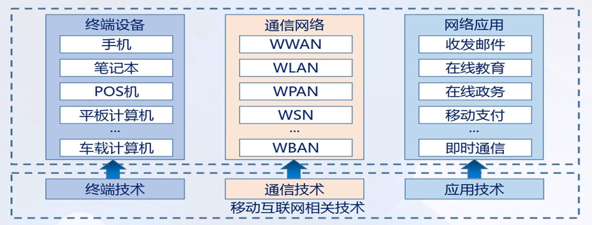
   - 安全架构：移动互联网终端安全、移动互联网网络安全和移动互联网应用安全。
     - 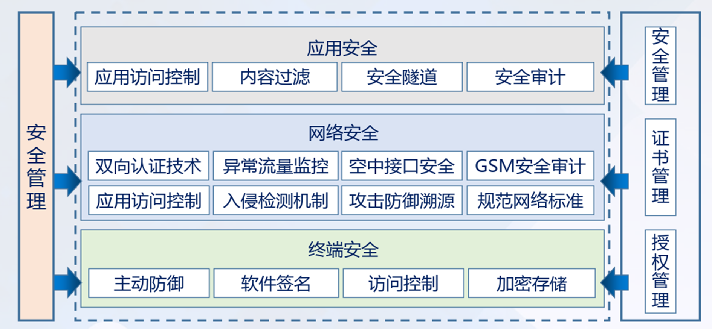
   - 安全挑战：十分严格地强调对用户隐私和用户行为的保护
     - 移动互联网涉及大量的用户个人信息（如位置信息、通信信息、日志信息、账户信息、支付信息、设备信息、文件信息等），给移动互联网安全监管和用户隐私保护带来极大的挑战
     - 当前，移动通信终端智能化程度日益提高，处理的信息更加多样化。因此，终端成为攻击者的重要目标之一，**恶意攻击行为逐步向强制推广、风险传播、越权收集等行为转变**。终端被攻击，容易造成用户经济损失、信息泄漏、业务滥用等问题。

4. **物联网**
   - 定义：依托射频识别RFID技术和设备，按约定的通信协议与互联网相结合，使物品信息实现智能化识别和管理，实现物品信息互联而形成的网络
   - 概念：物联网是指通过信息传感设备，按照约定的协议，把任何物品与互联网连接起来，进行信息交换和通讯，以实现智能化识别、定位、跟踪、监控和管理的一种网络。它是在互联网基础上延伸和扩展的网络。
   - 组成架构
     - 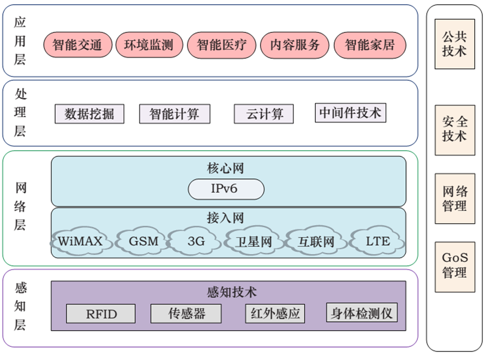
   - 安全挑战：
     - 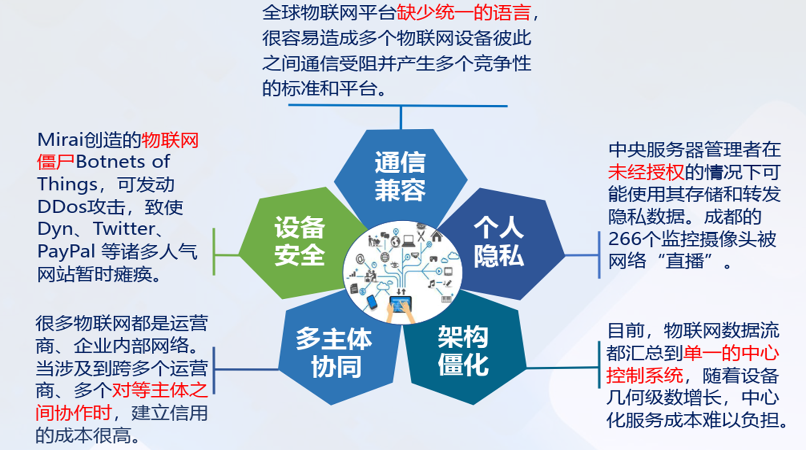
     - 感知层：感知层节点：网关节点、普通法节点等容易被恶意控制、捕获，容易受到外部DOS攻击；接入物联网的超大量传感节点的标识、认证易被劫持。
     - 网络层：异构的物联网应用协议无法被安全设备识别，被篡改和入侵后无法及时发现DOS攻击、假冒攻击、中间人攻击、跨异构网络攻击等
     - 管理服务层：存在高智能自动化处理系统带来不确定性，人为的干预导致服务不可用，设备丢失来自于超大量终端的海量数据的识别和处理
     - 应用层：许多应用层平台本身存在漏洞易导致未授权的访问、数据破坏和泄露、用户隐私保护；取证和销毁数据、保护知识产权
   - 安全防护技术
     - 安全和隐私保护方面，物联网应用的仍然是互联网或通信网中常规的安全防护技术。
     - 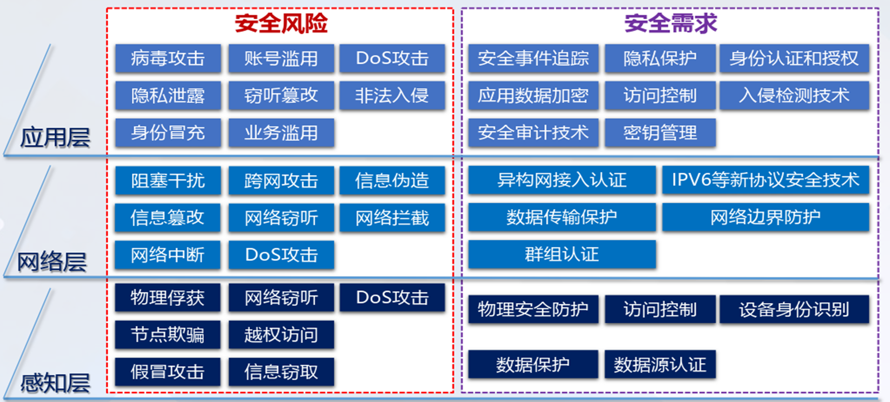
