# 第五章 内容安全基础

## 信息内容安全威胁
1. 信息内容安全概述
    - **定义**：信息内容安全(Content-based Information Security)是研究利用计算机从**海量信息且变化迅速**的网络中**自动获取、识别和分析特定安全主题相关信息**的技术，借助人工智能与大数据技术管理网络信息传播，是网络安全系统的核心理论与关键组成部分，对提高网络使用效率、净化网络空间、保障社会稳定意义重大。
    - **信息内容安全分类**
        - 政治信息安全
        - 军事信息安全
        - 商业信息安全
    - 领域、内涵及关键技术
        - 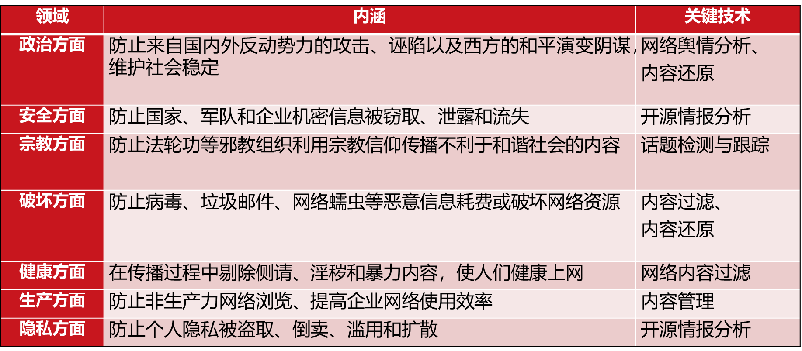

2. 网络信息内容安全的重要性
    - 提高网络用户及网站的使用效率。
    - 净化网络空间，营造健康文明的网络文化环境。
    - 提高国家信息安全保障水平，是保障国家安全的重要环节。

3. 信息内容安全威胁
    - 内容安全面临**泄露（非授权访问）、欺骗、破坏和篡夺**等威胁。
        - 
    - 恶意用户产生传播的**恶意内容**也是网络空间面临的潜在安全威胁。
  
4. 经典的信息内容安全挑战
    - **内容获取**
        - 动态网络社区信息的深入提取。
        - 跨网络媒体内容的高性能提取。
        - 混合网络身份内容获取。
    - **内容分析**
        - 多源网络媒体信息的数据清洗。
        - 海量非结构化信息的数据仓储与数据挖掘。
        - 多媒体群体理解技术有待发展。
    - **内容网络**
        - 内容中心网络命名攻击。
        - 内容中心网络缓存污染。
        - 内容中心网络路由攻击。

5. 典型的互联网恶意用户行为攻击
    - **Spam用户**：向合法用户发布广告、色情、钓鱼等恶意信息，在开放式在下社交网络上将恶意内容快速而大规模传播。
    - **Sybil攻击（女巫攻击）**：攻击者利用单个节点来伪造多个身份存在于P2P网络中，从而达到削弱网络的冗余性，降低网络健壮性，监视或干扰网络正常活动等目的。攻击者可以通过只部署一个实体，向网络中广播多个身份ID，来充当多个不同的节点（Sybil节点）。Sybil节点为攻击者争取了更多的网络控制权，一旦用户查询资源的路径经过这些Sybil节点，攻击者可以干扰查询、返回错误结果，甚至拒绝回复。
    - **水军用户**：通过评论或转发参与热点话题，用大量有情感倾向的评论影响舆情态势，如网络推手、打手、刷粉等行为。

6. 以内容为中心的未来互联网
    - **目标与意义**
        - 以内容为中心的未来互联网旨在**将内容名称而不是IP地址**作为传输内容的标识符，从而实现信息的路由。
    - 内容中心网络意义
        - 实施更多优化表示来增强网络性能
        - 提高未来互联网的智能水平
    - 内容中心攻击分类
        - **命名**：攻击者可审查和过滤内容。
        - **路由**：恶意攻击者能发布/订阅无效内容或路由。
        - **缓存**：可能污染或破坏缓存系统、侵犯中心网络隐私。
        - **其他**：传输过程中存在未经授权的访问/更改内容风险。

## 网络信息内容获取

1. **网络信息内容获取技术**
    - 获取范围
        - 与面向特定点的网络通讯信息获取不同，网络媒体信息获取理论上可覆盖整个国际互联网。
    - **网络媒体信息获取流程**
        - 初始URL集合
        - 信息获取
        - 信息解析
        - 信息判重
        - 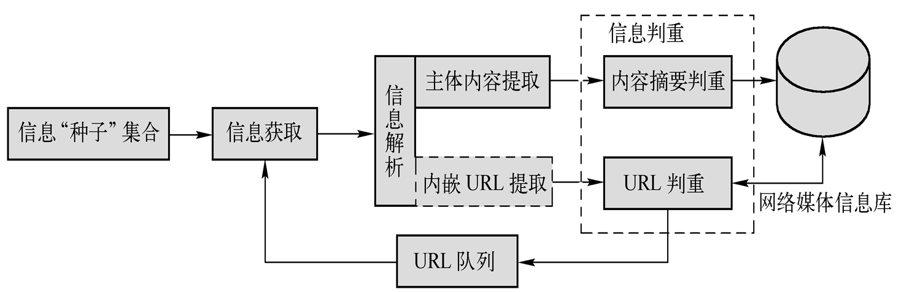

2. **基于浏览器模拟的获取技术**：
    - 利用JSSh客户端向内嵌JSSh服务器的网络浏览器发送JavaScript指令
    - 指示网络浏览器进行网络身份认证交互，网页发布信息浏览等操作。
    - 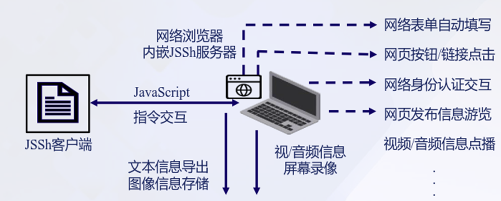

3. **信息内容获取的典型工具 - 网络爬虫**
    - 定义：在互联网上的实施信息内容获取的主要工具，是按照一定的规则，自动的抓取互联网信息的**程序或脚本**。
    - **分类(选择性)**：
        - 服务于搜索引擎等搜索类应用的网络爬虫
        - 针对性进行信息收集的网络爬虫
    - **分布式机制**：网络爬虫需要采用多进程或者多线程，甚至分布式机制来保证信息获取的全面性和时效性。

4. **信息内容特征抽取与选择**
    - 地位：信息内容的表示及其特征项的选取是**数据挖掘、信息检索**的一个基本问题，把从信息中抽取的**特征词**进行**量化**表示文本信息。
    
    1. **文本信息**
        - 文本转化为可处理的结构化形式
        - 文本特征选择以达到降维的目的，主要有字符串匹配、基于统计方法、基于理解方法
        - 文本特征项的特点：
            1. 特征项要能够确实标示文本内容;
            2. 特征项具有将目标文本与其他文本相区分的能力;
            3. 特征项的个数不能太多;
            4. 特征项分离要比较容易实现。
        - 特征抽取的主要功能：在不损伤文本核心信息的情况下尽量减少要处理的单词数，以此来降低向量空间维数，从而简化计算，提高文本处理的速度和效率。
        - 特征选取方式
            - 采用向量空间模型来描述文本向量
            - 通过特征选择来降维，找到代表性特征
        - 特征选择过程
            - 根据特征评估函数计算各个特征的评分值
            - 按照评分值对这些特征进行排序
            - 选取若干个评分值最高的作为特征词
        - 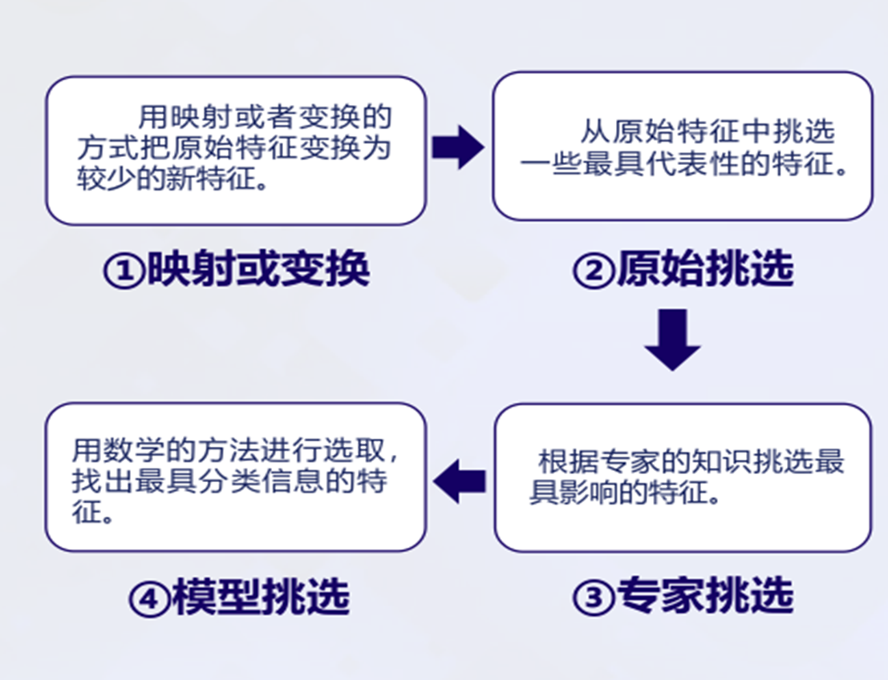
    2. **音频信息**
        - 提取音频的时域和频域特征
        - 建立数据库，对音频数据进行特征提取并通过特征对数据聚类
    3. **图像信息**
        - 图像颜色特征提取
        - 图像纹理特征提取
        - 其他图像特征提取

## 网络信息内容分析与处理

1. 信息内容分析环节
    - 海量信息内容分析基本处理环节可以归结为**分类和过滤**，其他更加复杂的处理问题则是上述简单处理问题的组合。
    - 在信息检索和文本编辑等应用中，快速对用户定义的模式或者短语进行分类是最常见的需求。**高效的分类和过滤算法**能使信息处理变得迅速而准确，反之，则会使处理过程变得冗长而模糊。

2. 信息内容分类
    - 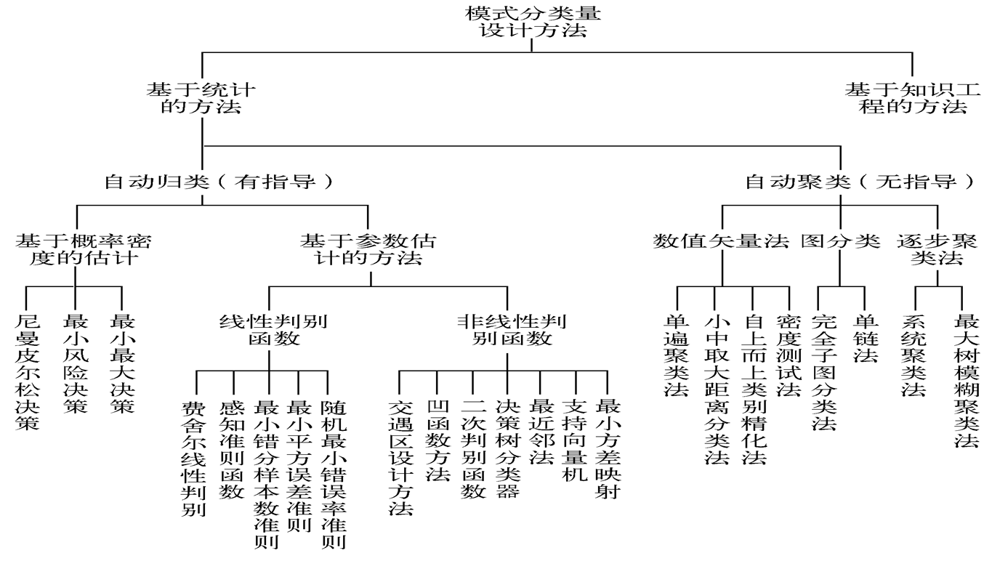

3. **线性分类器**：
    - 定义：通过寻找一个投影方向（线性变换，线性组合），将高维问题降低到一维问题来解决，并且要求变换后的一维数据具有如下性质：同类样本尽可能聚集在一起，不同类的样本尽可能地远。
    - X输入，$X_i$表示的是第i个输入；Y表示输出；W表示权向量；$\omega_0$是阈值，f是一个判别函数。
    - 基本思想：寻找合理决策超平面（确定投影方向和阈值$\omega_0$），通过给定训练数据确定线性判别函数。设这个超平面为w，满足以下两式子，即通过给定的训练数据确定线性判别函数。
        - $w^T * x>0, \forall x \in \omega_1$
        - $w^T * x<0, \forall x \in \omega_2$
    - 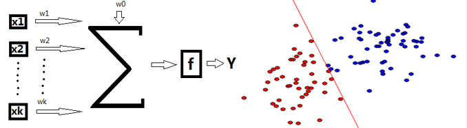
        
4. **最近邻分类法（KNN）**
    - 定义：
        - K最近邻(k-Nearest Neighbor-KNN)分类算法属于监督学习算法，多用于图像分类和识别领域。
    - **核心思想**：
        - **确定一个临近度的度量, 相似性越高，相异性越低的数据样本，可以认为是同一个数据类别**，即如果一个样本在特征空间中的K个最相近(特征空间中最邻近)的样本中的大多数属于某一个类别，则样本也属于这个类别。
    - **核心步骤**：
        - 数据清洗：数据规范化;
        - 确定临近度的度量，并计算临近度;
        - 按照临近度递增次序排序;
        - 选取与当前点距离最小的k个点;
        - 确定前k个点所在类别的出现频率;
        - 返回前k个点出现频率最高的类别作为当前点的预测分类。
    - 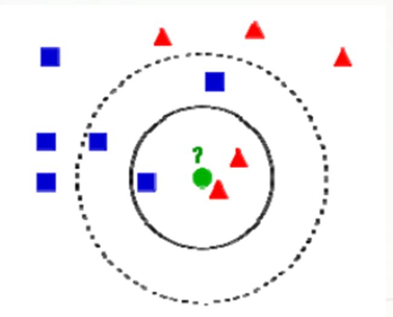
  
5.  **支持向量机（SVM）**
    - 定义：
        - SVM支持向量机（英文全称：support vector machine）是一个分类算法，通过找到一个分类平面，将数据分隔在平面两侧，从而达到分类的目的。
    - **分类基本思路**
        - **找到最合适的分类平面**，最直接的评估标准S是被分隔的两边数据距离平面间隔最大
        - 换句话，SVM就是获取最大间隔的超平面。$w * x + b = 0$确定的情况下，$|wx+b|$表示点距离超平面的距离，而超平面作为二分类器，如果$wx+b>0$，判断类别y为1, 否则判定为-1。
    - 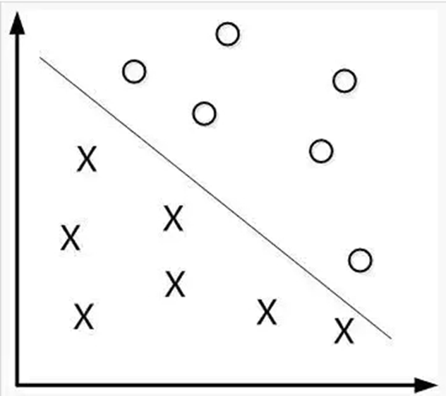
        

6. **信息内容过滤**
    - **定义**：
        - 信息过滤是大规模内容处理的一种典型操作，对陆续到达的信息进行过滤，是满足用户信息需求的信息选择过程。
        - 根据用户的信息需求，运用一定的标准和工具，从大量的动态网络信息流中选取相关的信息或剔除不相关信息的过程。
    - 说明：
        - 过滤系统是为无结构化和半结构化的数据而设计的信息系统；
        - 信息过滤系统主要用来处理大量的动态的信息；
        - 过滤是基于对个体或群组的信息偏好的描述，也称为用户取向；
        - 过滤是从动态的数据流中收集或去掉某些文本信息
    - 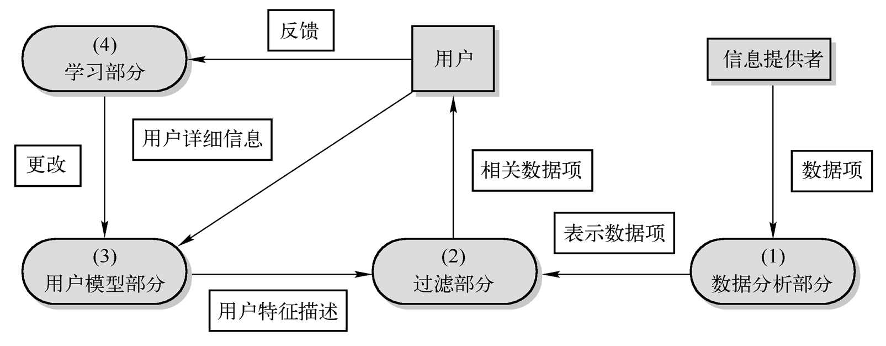
    - **任务**：
        - 信息过滤是提供信息的有效流动，消除或者减少信息过量、信息混乱、信息滥用造成的危害。**为用户剔除不合适的信息**是当前信息过滤的主要任务之一。
    - **技术分类**
        - **根据过滤方法**：
            - 分为基于内容的过滤
            - 基于用户兴趣的过滤
            - 协作过滤
        - **根据操作主动性**：
            - 主动过滤
            - 被动过滤
        - **根据过滤位置**：
            - 信息的源头过滤
            - 服务器和客户端过滤
        - **根据过滤的目的**
            - 用户过滤
            - 安全过滤
    - **常见应用**
        - **Internet搜索结果过滤**：如搜索引擎对同一问题返回众多结果时，筛选出更符合用户需求的内容。
        - **用户电子邮件过滤**：过滤垃圾邮件等。
        - **浏览器过滤**：定制浏览器按用户偏好过滤内容。
        - **专为未成年人过滤**：去除不适合未成年人的信息。
        - **为客户过滤**：根据客户爱好、兴趣进行信息筛选。

## 舆情系统功能及内容分析

1. 网络舆情系统概述
    - **定义**：舆情指在一定的社会空间内，围绕中介性社会事项的发生、发展和变化，作为主体的民众对作为客体的国家管理者产生和持有的社会政治态度。如果把中间的一些定语省略掉，**舆情就是民众的社会政治态度**。
    - **网络舆情系统**：
        - 对海量非结构化信息挖掘与分析；
        - 实现对网络舆情的热点、焦点、演变等信息的掌握；
        - 为网络舆情监测与引导部门的决策提供科学依据。
    - **网络舆情特点**：
        - 直接性：通过网络直接发表意见，传播迅速
        - 随意性和多元化：网民可匿名发表观点，健康观点和灰色言论并存
        - 突发性：网络快速传播的特性使关注焦点迅速成长为舆论热点
        - 隐蔽性：虚拟网络空间中网民可以隐身发言
        - 偏差性：网络舆情不等同于全民立场

2. 网络舆情监测技术的发展趋势
    - **针对信息源的深入信息采集**：
        - 传统搜索引擎一般采用**广度优先**的策略遍历Web并下载文档。
        - 不能完全满足实际需求，其主要不足体现在——**互联网定点信息源信息的提取率过低**。
    - **异构信息融合分析**：
        - 互联网信息在**编码、数据格式以及结构组成**方面存在巨大差异。
        - 信息分析与提取的重要前提是对信息在**同一表达或标准**的前提下进行有机的结合
    - **非结构信息的结构化表达**：
        - 非结构化信息对于阅读者而言比较容易理解，但对于计算机信息处理系统却相当困难。
        - 目前已有优秀的技术与方法可以对结构化数据进行分析。
        - 说明：
            - 结构化数据是指按照预定义的模型结构化或以预定义的方式组织的数据，结构化数据通常存储在关系数据库管理系统(RDBMS)中。
            - 非结构化数据指那些无法用固定结构来逻辑表达实现的数据，简单来说就是用户散落在论坛、微博、微信或其他渠道发表的关于产品的各种评价或吐槽。
            - 非结构化数据主要包含三大块：第一是文本文字；第二是图像、图片等；第三是视频流、电视流，还有网页、元数据等。

3. 网络舆情系统的功能分解
    - **高仿真网络信息深度提取技术**：
        - 是舆情监控系统信息获取模块的核心，重点研究**原创网络互动式动态信息提取**，形成高性能动态信息提取系统，组成舆情监控系统的信息获取模块。
        - 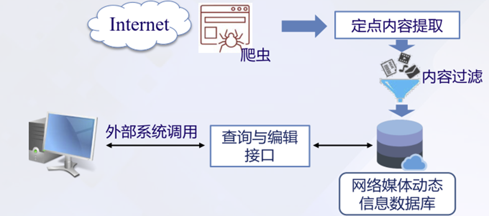
    - **基于语义的海量媒体内容特征快速提取与分类技术**：
        - 实现信息特征提取和结构化转变功能，组成舆情监控系统信息分析模块。
        - 为实现舆情的分析、监测与预警完成信息转化。
        - 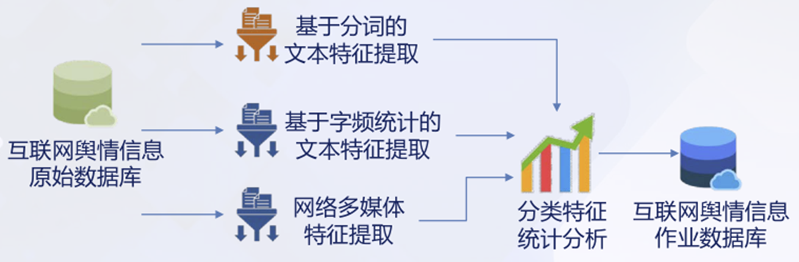
    - **非结构信息自组织聚合表达技术**：
        - 满足网络舆情监测预警基础设施与典型应用的实际需求，组成数据分类、仓储和挖掘引擎模块。
        - 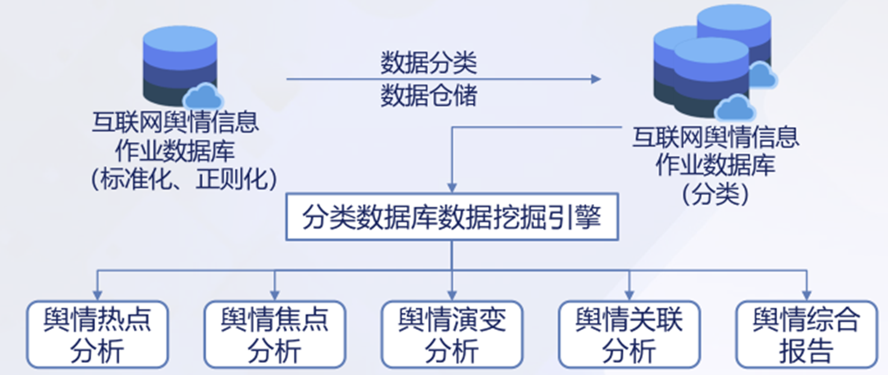

4. **互联网舆情内容分析**
    - **深度挖掘技术**：利用定向搜索手段完成针对指定信息源的深入、全面的**内容提取**操作，以面向结构迥异、风格多样的数据发布源实施互联网媒体信息监控工作。
    - 关键技术
        - 异构信息归一化
        - 网络热点自动发现
        - 协商与人际对话模拟
        - 热点数据报告定制

## 内容中心网络及安全

1. 内容中心网络概述
    - **定义**：
        - 内容中心网络(Content Centric Network,CCN)是2009年提出的新型下一代网络体系结构，是一个基于内容的网络。
    - **核心思想**：
        - **对网络中的每个内容命名, 而不是使用主机和节点的 IP 地址**。当需要获取一个内容/服务时, 网络节点将发送一个包含所需内容/服务名字的请求。该请求按照内容名字进行路由, 而不是 IP 地址。
    - **目标**：
        - 替代现有的以 IP 为核心的网络体系架构，“以数据为中心”将通信范式的重点从关注于`where` (地址、服务器、主机)转变到`what`（通信的内容）。以对数据命名的方式代替位置（IP地址），将数据转变成网络的第一要素。

2. 内容中心网络架构
    - **基本原理**：摒弃IP地址为中心的传输架构，采用**以内容名称为中心**的架构，通过**以内容为中心的订阅机制和语义主导的命名、路由和缓存策略**，在解决当前基于IP地址进行联网的模式上体现出了巨大的潜力
    - **架构组成部分**
        - **内容信息对象**：存储在计算机中并可访问的各类对象，如网页、文档、电影、照片、音乐等。
        - **命名**：是信息对象的标识，具有**全局性和唯一性**。其地位与TCP/IP架构的IP地址类似。
            - 分层命名方案
            - 扁平命名方案
        - **路由**：
            - 
        - **缓存**：每个CCN节点维护**缓存表**，用于缓存CCN路由器接收的内容消息对象，以便**响应后继接收到的相同请求**。
        - **应用程序编程接口**：CCN应用程序编程接口根据**请求和交付**内容信息对象定义，用于内容信息对象的**发布和获取**操作。

3. 面向内容中心网络的攻击分类
    - **命名相关攻击**：
        - 监视列表攻击
        - 嗅探攻击
    - **路由相关攻击**：
        - DDOS攻击
        - 欺骗攻击
    - **缓存相关攻击**：
        - 驱逐流行内容攻击
    - **其他攻击**：
        - 假冒攻击
        - 重放攻击

4. 基于雾计算的内容信息中心网络安全防护架构
    - 基于雾计算的智能防火墙模型：
        - 利用**雾计算范式**在**网络边缘**实现了**隔离防御**系统；
        - 基于已有的安全策略，该防火墙能够实现对**兴趣包洪泛攻击**的智能感知和动态防御。
        - 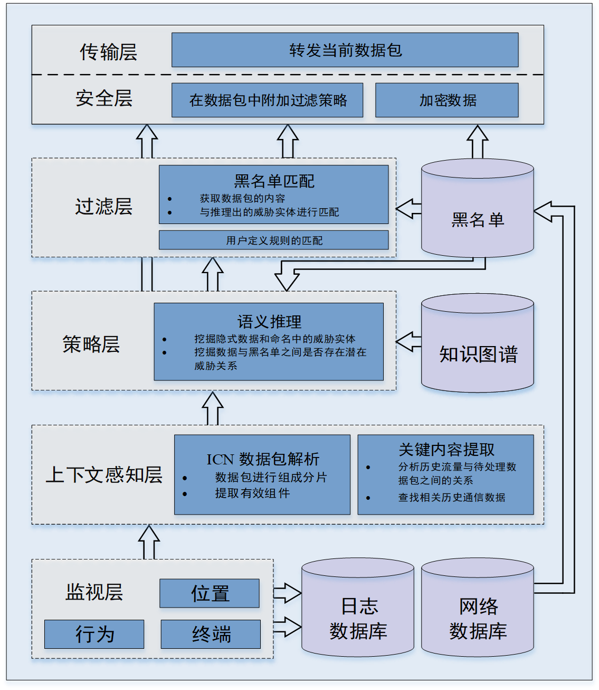